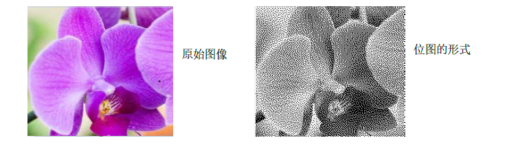

# QBitmap

## 基本原理

1. `QBitmap`继承自`QPixmap`，该类描述的是1位深度(单色)的像素图，即只有两种色的像素图。
2. 该类主要用于创建自定义`QCursor`对象、`QRegion`对象以及设置图像的蒙版等。
3. 若把深度大于1的像素图分配给`QBitmap`，则`QBitmap`将自动抖动
4. 使用Qt::color0将位图的位设置为0，使用Qt::color1把位图的位设置为1。其中0表示背景(透明像素)，1表示前景(不透明像素)。注意：使用Qt::black(黑色)和Qt::white(白色)没有意义   

## 函数

1. 构造函数
   1. `QBitmap()`
   2. `QBitmap(const QPixmap &pixmap)`
   3. `QBitmap(int width, int height)`
   4. `QBitmap(const QSize &size)`
   5. `QBitmap(const QString &fileName, const char *format = Q_NULLPTR)`
   6. `QBitmap(const QBitmap &other)`
2. 清除位图，即把所有位设置为Qt::color0
   1. `void clear()`
3. 交换
   1. `void swap(QBitmap &other)`
4. 使用变换矩阵matrix变换位图，并返回变换后的副本
   1. `QBitmap transformed(const QTransform &matrix) const`
5. 把图像image转换为位图，并返回其副本
   1. `static QBitmap fromImage(const QImage &image,Qt::ImageConversionFlags flags = Qt::AutoColor)`
6. 构造一个大小为size的位置，并把内容设置为bits，位图数据必须是字节对齐的，并需按monoFormat指定的位顺序提供，单色图格式必须是QImage::Format_Mono或QImage::Format_MonoLSB
   1. `static QBitmap fromData(const QSize &size, const uchar *bits,QImage::Format monoFormat = QImage::Format_MonoLSB)`