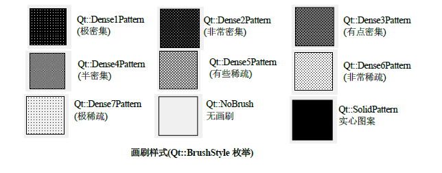
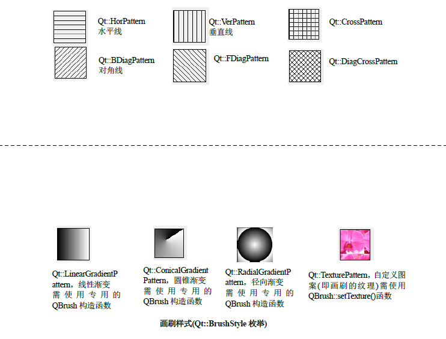

# QBrush

## 画刷基础

1. `QPainter`中与画刷相关的函数
   1. 设置画刷
      1. `void setBrush(const QBrush &brush)`
      2. `void setBrush(Qt::BrushStyle style) const`
      3. `QBrush &brush() const`
   2. 设置透明度,设置在0-1之间
      1. `void setOpacity(qreal opacity)`
      2. `qreal opacity() const`
2. `QBrush类`(画刷)用于描述`QPainter`绘制的图形的填充颜色或图案
3. 画刷定义了样式、颜色、渐变和纹理
   1. 颜色:画刷使用`setColor()`或在`QBrush()`的构造函数中设置颜色
   2. 渐变:渐变色需要使用QRradient类及其子类，并在`QBrush()`构造函数中设置
   3. 纹理:纹理使用`setTexture()`或在`QBrush()`的构造器中设置
   4. 样式:样式通过`setStyle()`函数设置    

## 函数

1. 构造函数 
   1. 构造一个默认黑色，样式为Qt::NoBrush(即不会填充形状)的画刷
      1. `QBrush()`
   2. 使用颜色color和样式style构造一个画刷
      1. `QBrush(Qt::BrushStyle style)`
      2. `QBrush(const QColor &color, Qt::BrushStyle style = Qt::SolidPattern)`
      3. `QBrush(Qt::GlobalColor color, Qt::BrushStyle style = Qt::SolidPattern)`
   3. 使用颜色color和/或像素图pixmap构造一个画刷，样式被设置为Qt::TexturePattern
      1. `QBrush(const QColor &color, const QPixmap &pixmap)`
      2. `QBrush(Qt::GlobalColor color, const QPixmap &pixmap)`
      3. `QBrush(const QPixmap &pixmap)`
      4. `QBrush(const QImage &image)`
   4. 构造渐变色画刷
      1. `QBrush(const QGradient &gradient)`
2. 颜色、样式、透明性
   1. 颜色,若画刷时渐变、纹理的使用不生效
      1. `const QColor &color() const`
      2. `void setColor(const QColor &color)`
      3. `void setColor(Qt::GlobalColor color)`
   2. 样式
      1. `void setStyle(Qt::BrushStyle style)`
      2. `Qt::BrushStyle style() const`
   3. 渐变,需要在构造函数中设置
      1. `const QGradient *gradient() const`
   4. 是否完全透明  
      * `color()`的alpha分量255时为不透明
      * 纹理`texture()`不透明
      * 渐变`gradient()`中的颜色都具有255的alpha分量(不透明)
      * 扩散的辐射渐变是透明的
      * 位图`QBitmap`是透明的
      1. `bool isOpaque() const`
   5. 纹理(自定义图案)
      1. `QPixmap texture() const`
      2. `void setTexture(const QPixmap &pixmap)`
      3. `QImage textureImage() const`
      4. `void setTextureImage(const QImage &image)`
        * 设置画刷的图像为image，样式被设置为Qt::TexturePattern(纹理)，注意：该函数与使用QBitmap调用QBrush::setTexture()不同，当前画刷不会对单色图像产生作用，若要改变单色图像的颜色，可使用QBitmap::fromImage()把图像转换为QBitmap，并把生成的QBitmap设置为纹理
3. 坐标变换
   1. 设置画刷的变换矩阵，把画刷的变换矩阵与`QPainter`的变换矩阵合并，以产生最终的结果
      1. `const QMatrix &matrix() const`
      2. `void setMatrix(const QMatrix &matrix)`
      3. `QTransform transform() const`
      4. `void setTransform(const QTransform &matrix)`