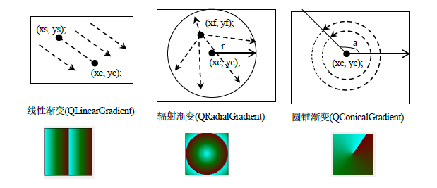
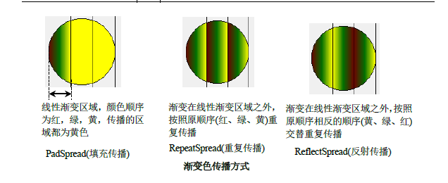
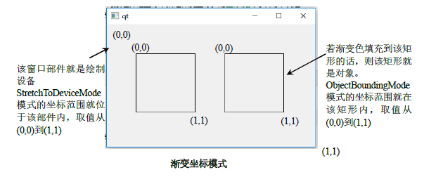

# QGradient

## 基本原理

1. `QGridient`类与`QBrush`类一起用于指定渐变填充
2. Qt目前支持三种类型的渐变填充 <br> 
   1. 线性渐变:使用`QLinearGradient`类描述
   2. 辐射(径向)渐变:使用`QRadialGradient`类描述,由中心点(xc, yc)和半径r定义一个圆(该圆即为辐射渐变区域)，然后颜色从焦点(xf, yf)向外扩散
   3. 圆锥渐变:由`QConicalGridient`类描述,由一个中心点(xc, yc)和一个角度a定义，然后颜色在中心点周围像钟表那样扩散
3. 渐变颜色的设置
   1. 渐变颜色不能使用`QBrush::setColor()`函数设置
   2. 渐变颜色需要使用停止点和颜色两个属性来指定，可使用`QGradient::setColorAt()`函数来设置单个的停止色和颜色
   3. 也可以使用`QGradient::setStops()`来一次定义多个<停止，颜色>对，`setStops()`函数需要使用`QGradientStop`类型的参数
   4. 停止点使用的是0~1之间的数值来表示的，0表示起点，1表示终点
   5. `QGradientStop`类型为`typedef QPair<qreal,QColor> QGradientStop`
4. 渐变色的传播方式(spread) <br> 
   1. 渐变色的传播是指在渐变区域以外的区域渐变色是怎么扩散的
   2. 使用`QGradient::setSpread()`函数进行设置
   3. 传播方式仅对线性渐变和辐射渐变有作用，因为这两种类型的渐变是有边界的，而锥形渐变其渐变范围为0-360度的圆，没有渐变边界，不适用于锥形传播
5. 坐标模式 <br> 
   1. 就是指怎么指定渐变色的坐标，使用`QGradient::setCroodinateMode()`函数进行设置

## 枚举

1. 渐变类型
   
```cpp
enum Type{
    LinearGradient,//线性渐变
    RadialGradient,//辐射渐变
    ConicalGradient,//锥形渐变
    NoGradient//无渐变
}
Q_ENUM(Type);
```
2. 传播方式
   
```cpp
enum Spread{
    PadSpread,//渐变填充传播，渐变在区域外使用与终止色最接近的颜色
    ReflectSpread,//渐变反射传播，渐变在区域外以相反的方式在区域外传播
    RepeatSpread//渐变重复传播，渐变在区域外重复传播
}
Q_ENUM(Spread)
```
3. 坐标模式

```cpp
enum CoordinateMode{
    LogicalMode,//渐变的坐标与对象坐标轴相同，默认值
    StretchToDeviceMode,//设备边界模式，渐变坐标位于绘制设备的边界矩形内，左上角为(0,0),右下角为(1,1)
    ObjectBoundingMode,//对象边界模式，渐变坐标位于对象的边界矩形内，左上角为(0,0),右下角为(1,1)
    ObjectMode //与ObjectBoundingMode相同，已经废弃
}
Q_ENUM(CoordinateMode)
```

4. 插值模式

```cpp
 enum InterpolationMode {
     ColorInterpolation,//颜色插值
     ComponentInterpolation//组件插值
 };
``

5. 指定如何填充渐变区域外的区域

```cpp
enum Preset {
     WarmFlame = 1,
     NightFade = 2,
     SpringWarmth = 3,
     JuicyPeach = 4,
     YoungPassion = 5,
     LadyLips = 6,
     SunnyMorning = 7,
     RainyAshville = 8,
     FrozenDreams = 9,
     WinterNeva = 10,
     DustyGrass = 11,
     TemptingAzure = 12,
     HeavyRain = 13,
     AmyCrisp = 14,
     MeanFruit = 15,
     DeepBlue = 16,
     RipeMalinka = 17,
     CloudyKnoxville = 18,
     MalibuBeach = 19,
     NewLife = 20,
     TrueSunset = 21,
     MorpheusDen = 22,
     RareWind = 23,
     NearMoon = 24,
     WildApple = 25,
     SaintPetersburg = 26,
     PlumPlate = 28,
     EverlastingSky = 29,
     HappyFisher = 30,
     Blessing = 31,
     SharpeyeEagle = 32,
     LadogaBottom = 33,
     LemonGate = 34,
     ItmeoBranding = 35,
     ZeusMiracle = 36,
     OldHat = 37,
     StarWine = 38,
     HappyAcid = 41,
     AwesomePine = 42,
     NewYork = 43,
     ShyRainbow = 44,
     MixedHopes = 46,
     FlyHigh = 47,
     StrongBliss = 48,
     FreshMilk = 49,
     SnowAgain = 50,
     FebruaryInk = 51,
     KindSteel = 52,
     SoftGrass = 53,
     GrownEarly = 54,
     SharpBlues = 55,
     ShadyWater = 56,
     DirtyBeauty = 57,
     GreatWhale = 58,
     TeenNotebook = 59,
     PoliteRumors = 60,
     SweetPeriod = 61,
     WideMatrix = 62,
     SoftCherish = 63,
     RedSalvation = 64,
     BurningSpring = 65,
     NightParty = 66,
     SkyGlider = 67,
     HeavenPeach = 68,
     PurpleDivision = 69,
     AquaSplash = 70,
     SpikyNaga = 72,
     LoveKiss = 73,
     CleanMirror = 75,
     PremiumDark = 76,
     ColdEvening = 77,
     CochitiLake = 78,
     SummerGames = 79,
     PassionateBed = 80,
     MountainRock = 81,
     DesertHump = 82,
     JungleDay = 83,
     PhoenixStart = 84,
     OctoberSilence = 85,
     FarawayRiver = 86,
     AlchemistLab = 87,
     OverSun = 88,
     PremiumWhite = 89,
     MarsParty = 90,
     EternalConstance = 91,
     JapanBlush = 92,
     SmilingRain = 93,
     CloudyApple = 94,
     BigMango = 95,
     HealthyWater = 96,
     AmourAmour = 97,
     RiskyConcrete = 98,
     StrongStick = 99,
     ViciousStance = 100,
     PaloAlto = 101,
     HappyMemories = 102,
     MidnightBloom = 103,
     Crystalline = 104,
     PartyBliss = 106,
     ConfidentCloud = 107,
     LeCocktail = 108,
     RiverCity = 109,
     FrozenBerry = 110,
     ChildCare = 112,
     FlyingLemon = 113,
     NewRetrowave = 114,
     HiddenJaguar = 115,
     AboveTheSky = 116,
     Nega = 117,
     DenseWater = 118,
     Seashore = 120,
     MarbleWall = 121,
     CheerfulCaramel = 122,
     NightSky = 123,
     MagicLake = 124,
     YoungGrass = 125,
     ColorfulPeach = 126,
     GentleCare = 127,
     PlumBath = 128,
     HappyUnicorn = 129,
     AfricanField = 131,
     SolidStone = 132,
     OrangeJuice = 133,
     GlassWater = 134,
     NorthMiracle = 136,
     FruitBlend = 137,
     MillenniumPine = 138,
     HighFlight = 139,
     MoleHall = 140,
     SpaceShift = 142,
     ForestInei = 143,
     RoyalGarden = 144,
     RichMetal = 145,
     JuicyCake = 146,
     SmartIndigo = 147,
     SandStrike = 148,
     NorseBeauty = 149,
     AquaGuidance = 150,
     SunVeggie = 151,
     SeaLord = 152,
     BlackSea = 153,
     GrassShampoo = 154,
     LandingAircraft = 155,
     WitchDance = 156,
     SleeplessNight = 157,
     AngelCare = 158,
     CrystalRiver = 159,
     SoftLipstick = 160,
     SaltMountain = 161,
     PerfectWhite = 162,
     FreshOasis = 163,
     StrictNovember = 164,
     MorningSalad = 165,
     DeepRelief = 166,
     SeaStrike = 167,
     NightCall = 168,
     SupremeSky = 169,
     LightBlue = 170,
     MindCrawl = 171,
     LilyMeadow = 172,
     SugarLollipop = 173,
     SweetDessert = 174,
     MagicRay = 175,
     TeenParty = 176,
     FrozenHeat = 177,
     GagarinView = 178,
     FabledSunset = 179,
     PerfectBlue = 180,
 };
 Q_ENUM(Preset)
```

## 函数

1. 渐变的坐标模式
   1. `CoordinateMode coordinateMode() const`
   2. `void setCoordinateMode(CoordinateMode mode)`
2. 渐变的传播模式
   1. `Spread spread() const`
   2. `void setSpread(Spread method)`
3. 渐变<位置，颜色>对
   1. `QGradientStops stops() const`
   2. `void setStops(const QGradientStops &stopPoints)`
4. 把停止位置position处的颜色设置为color
   1. `void setColorAt(qreal position, const QColor &color)`
5. 渐变的类型
   1. `Type type() const`

## 示例

### 渐变坐标模式

```cpp
#ifndef WIDGET_H
#define WIDGET_H

#include <QtWidgets>
#include <QLinearGradient>
class DrawGradient :public QWidget
{
    Q_OBJECT
private:
    void init(){

    }
protected:
    void paintEvent(QPaintEvent *event) override{
        Q_UNUSED(event)

        QPainter painter;
        painter.begin(this);

        QPen pen =painter.pen();
        QLinearGradient gradient(QPointF(0.1,0.50),QPointF(0.50,0.50));
        gradient.setCoordinateMode(QGradient::ObjectBoundingMode);
        gradient.setColorAt(0,QColor(255,255,255)); //渐变起始颜色
        gradient.setColorAt(0.5,QColor(111,1,1));
        gradient.setColorAt(1,QColor(255,255,1));//渐变最终停止点颜色
        gradient.setSpread(QGradient::RepeatSpread); //设置渐变色传播模式
        QBrush brush(gradient);
        painter.setBrush(brush);

        /*设置连接点*/
#if 1
        QPainterPath path;
        path.addRect(50,50,100,100);

        pen.setJoinStyle(Qt::MiterJoin);
        painter.setPen(pen);
        painter.drawPath(path);

        pen.setJoinStyle(Qt::BevelJoin);
        painter.setPen(pen);
        path.translate(120,0);
        painter.drawPath(path);

        pen.setJoinStyle(Qt::RoundJoin);
        painter.setPen(pen);
        path.translate(120,120);
        painter.drawPath(path);

        pen.setJoinStyle(Qt::SvgMiterJoin);
        painter.setPen(pen);
        path.translate(0,120);
        painter.drawPath(path);

        pen.setJoinStyle(Qt::MPenJoinStyle);
        painter.setPen(pen);
        path.translate(240,0);
        painter.drawPath(path);
#endif
        painter.end();
    }

public:
    DrawGradient(QWidget *p =nullptr) :QWidget(p){ init(); }
};

#endif // WIDGET_H

```