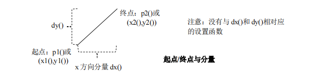
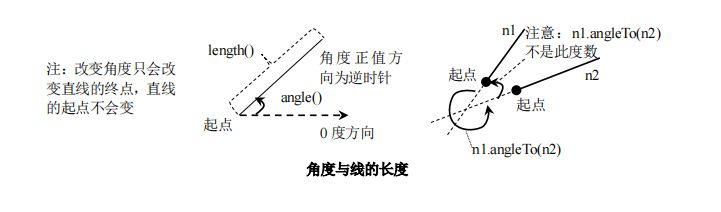
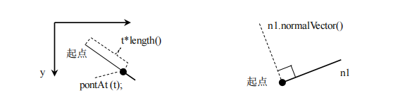
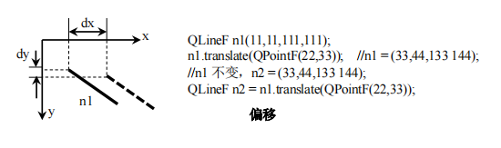

# QLineF

## 枚举

1. 相交类型
   ```cpp
   enum IntersectType{
       NoIntersect,//不相交
       UnboundedIntersection,//两线相交，但交点不位于两条线上
       BoundedIntersection //两线相交，交点位于两条线上
   }
   ```

## 函数

### 起点/终点于分量



1. `QPointF p1() const`
2. `QPointF p2() const`
3. `qreal dx() const`
4. `qreal dy() const`
5. `qreal x1() const`
6. `qreal y1() const`
7. `qreal x2() const`
8. `qreal y2() const`
9. `void setP1(const QPointF &p1)`
10. `void setP2(const QPointF &p2)`
11. `void setLine(qreal x1, qreal y1, qreal x2, qreal y2)`
12. `void setPoints(const QPointF &p1, const QPointF &p2)`

### 角度与线的长度



1. 直线的角度
    1. `qreal angle() const`
    2. `void setAngle(qreal angle)`
2. 直线的长度
    1. `qreal length() const`
    2. `void setLength(qreal length)`
3. 该线需要旋转多少度才与线 line 的度数相同(注意，这不是指的两线相交的角度 `qreal angleTo(const QLineF &line) const`



1. 返回位于直线上 t*length()处的点 `QPointF pointAt(qreal t) const`
2. 返回与此线有相同起点和长度并与该线垂直的线 `QLineF normalVector() const`
3. 返回与此线有相同起点和方向，长度为 1.0 的线，即单位向量 `QLineF unitVector() const`

### 相交

1. 该线是否与线 line 相交，交 点保存于 intersectionPoint 指针中 `IntersectType intersect(const QLineF &line, QPointF *intersectionPoint) const`

### 偏移



1. 把直线沿 x 轴移动距离 dx，沿 y 轴移动距离 dy，负值向反方向移动
    1. `void translate(const QPointF &offset)`
    2. `void translate(qreal dx,qreal dy)`
    3. `QLineF translated(const QPonitf &offset) const`
    4. `QLineF translated(qreal dx, qreal dy) const`

### 其他

1. 返回该线的占点，相当于 0.5*p1() + 0.5*p2() `QPointF center() const`
2. 返回此线的整数副本(注意：相应数值会被四舍五入为最近的整数) `QLine toLine() const`
3. 若线未设置有效的起点和终点，则返回 true `bool isNull() const`
4. 返回长度为length，角度为angle的线 `static QLineF fromPolar(qreal length, qreal angle)`

## 示例

```cpp
#pragma once

#if _MSC_VER >= 1600
#pragma execution_character_set("utf-8")
#endif


#include <QtWidgets>


class CustomPlot :public QWidget
{
	Q_OBJECT
private:
	QLineF line;
	QPushButton *btn;
	void init() {
		line = QLineF(11, 11, 111, 111);//初始化直线
		btn = new QPushButton("更新",this);

		connect(btn, &QPushButton::clicked, this, &CustomPlot::updateLine);
	}
protected:
	void paintEvent(QPaintEvent *event) override {
		Q_UNUSED(event);
		QPainter painter;
		painter.begin(this);
		painter.drawLine(line);
		painter.end();
	}
private slots:
	void updateLine() {
		line.translate(22, 22);
		update(); //关键操作，不使用update函数的话，只有在界面调整大小，移动等操作时才会调用paintEvent函数
	}
public:
	CustomPlot(QWidget *p = nullptr) : QWidget(p) { init(); }
};


```

