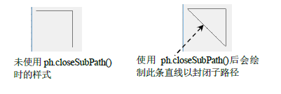
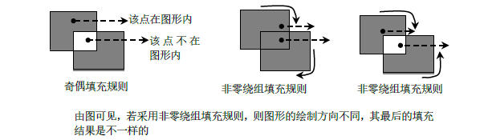
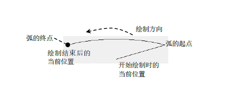

# QPainterPath

## 基本原理

1. `QPainter`中使用的函数
   1. `void drawPath(const QPainterPath &path)`
2. `QPainterPath`是一个容器，可以把图形形状保存其中，需要使用时可再次使用，也就是复杂的图形结构使用`QPainterPath`创建一次后，就能够使用`drawPath()`多次绘制
3. 路径可以时封闭的也可以是非封闭的
4. 子路径:路径是由多个图形组成的对象，每个形状构成一个子路径
5. 图形的绘制步骤:
   1. 创建`QPainterPath`对象
   2. 使用`moveTo`把当前点移动至需要绘制图形的开始位置
   3. 使用`lintTo()`、`arcTo()`等函数绘制直线、弧等图形，还可以使用`addRect()`、`addEllipse()`等函数将需要绘制的图形添加到路径中
   4. 使用`QPainter::drawPath()`函数绘制路径所描述的图形
6. 当前点的位置：使用lineTo()函数等函数绘制图形后，会更新当前点的位置，具体更新规则依使用的函数而不同，使用lintTo()会绘制图形后，当前点会被更新为直线的终点，使用addRect()绘制图形后，当前点会被更新为矩形的左上角，addPolygon()把当前点更新为最后一点
7. closeSubpath()：该函数通过画一条到子路径开头的线来关闭当前子路径，并开启一个新的子路径，新路径当前点为(0,0) <br> 
8. **填充规则(Fill Rule)**: 填充规则用于判断应该填充图形的哪些区域，或者说用于判断某些点是否位于图形内，有以下两种填充规则 <br> 
   1. 奇偶(odd even):从该点向图形外绘制一水平直线，若该线与图形交点的个数为奇数，则表明该点位于图形之中
   2. 非零绕组(non zero winding):从该点向图形外绘制一条水平直线，然后确定该直线与图形每个交点处的边线的方向，如把顺时针方向绘制的边线记为1，把逆时针方向绘制的边线记为-1，然后把所有数值相加，若结果不为0，则该点位于图形内部
9. 元素(element):路径中的每一个绘制步骤被称为元素
10. 注意：`addEllipse()`、`addPath()`、`addPolygon()`、`addRect()`、`addRegion()`和`addText()`这些函数实现上是都是使用`moveTo()`、`lintTo()`、`cubicTo()`函数来完成绘制的

## 枚举

1. 元素类型
```cpp
enum ElementType{
    MoveToElement,//一个新的子路径
    LineToElement,//一个线
    CurveToElement,//一个曲线
    CurveToDataElement,//在CurveToElement元素中描述曲线所需的额外数据
}
```


## 函数

1. 移动当前点的位置
   1. `moveTo(const QPointF &point)`
   2. `moveTo(qreal x, qreal y)`
2. 画一条到子路径开头的线，然后关闭当前路径
   1. `closeSubpath()`
3. 返回路径的当前位置
   1. `QPointF currentPosition() const`
4. 绘制一条到点endPoint的直线
   1. `lineTo(const QPointF &endPoint)`
   2. `lineTo(qreal x, qreal y)`
5. 添加矩形，顺时针方向
   1. `addRect(const QRectF &rectangle)`
   2. `addRect(qreal x, qreal y, qreal width, qreal height)`
6. 添加椭圆，顺时针方向
   1. `addEllipse(const QRectF &boundingRectangle)`
   2. `addEllipse(qreal x, qreal y, qreal width, qreal height)`
   3. `addEllipse(const QPointF &center, qreal rx, qreal ry)`
7. 添加路径
   1. `addPath(const QPainterPath &path)`
8. 添加多边形(注意：多边形不会自动封闭)
   1. `addPolygon(const QPolygonF &polygon)`
9. 添加圆角矩形，顺时针方向
   1.  `addRoundedRect(const QRectF &rect, qreal xRadius, qreal yRadius,Qt::SizeMode mode = Qt::AbsoluteSize)`
   2.  `void addRoundedRect(qreal x, qreal y, qreal w, qreal h, qreal xRadius,qreal yRadius, Qt::SizeMode mode = Qt::AbsoluteSize)`
10. 添加文本
    1.  `addText(const QPointF &point, const QFont &font, const QString &text)`
    2.  `addText(qreal x, qreal y, const QFont &font, const QString &text)`
11. 添加区域
    1.  `addRegion(const QRegion &region)`
12. 路径填充规则
    1.  `Qt::FillRulefillRule() const`
    2. `void setFillRule(Qt::FillRule fillRule)`
13. 移动当前点的位置，其位置位于矩形rectangle的内接椭圆上，在椭圆上的具体坐标位置由angle根据椭圆参数方程x = a cos (angle); y = b sin (angle)
    1. `void arcMoveTo(const QRectF &rectangle, qreal angle)`
    2. `void arcMoveTo(qreal x, qreal y, qreal width, qreal height, qreal angle)`
14. 以上的角度是直接以度数指定的(而不是1/16度)，注意：弧是按逆时针方向绘制的，开始绘制时会把弧的起点连接到当前位置，绘制完成后，不会自动封闭图形 <br> 
    1. `void arcTo(const QRectF &rectangle, qreal startAngle, qreal sweepLength)`
    2. `void arcTo(qreal x, qreal y, qreal width, qreal height, qreal startAngle, qreal sweepLength)`
15. 若路径中没有元素，或仅有唯一元素MoveToElement
    1. `bool isEmpty() const`
16. 返回当前路径的长度、元素数量
    1.  `qreal length() const`
    2.  `int elementCount() const`
17. 把索引index处的元素的x和y坐标设置为x和y，索引就是绘制图形时使用的moveTo()、lineTo()等函数的顺序(从0开始)
    1.  `void setElementPositionAt(int index,qreal x,qreal y)`
18. 返回索引index处的元素
    1.  `QPainterPath::Element elementAt(int index) const`
19. 交集、并集、相减、平移
    1.  交集
        1. `QPainterPath intersected(const QPainterPath &p) const`
        2. `bool intersects(const QRectF &rectangle) const`
        3. `bool intersects(const QPainterPath &p) const`
     1. 并集
        1. `QPainterPath united(const QPainterPath &p) const`
     2. 相减
        1. `QPainterPath subtracted(const QPainterPath &p) const`
     3. 平移
        1. `void translate(qreal dx, qreal dy)`
        2. `void translate(const QPointF &offset)`
        3. `QPainterPath translated(qreal dx, qreal dy) const`
        4. `QPainterPath translated(const QPointF &offset) const`

## 示例


### 绘制路径

```cpp
#ifndef WIDGET_H
#define WIDGET_H

#include <QtWidgets>

class DrawPath :public QWidget
{
    Q_OBJECT
private:
    void init(){

    }
protected:
    void paintEvent(QPaintEvent *event) override{
        Q_UNUSED(event)

        QPainter painter;
        painter.begin(this);
        painter.setBrush(QBrush(Qt::green));

        QPainterPath path;
        path.moveTo(11,11);
        path.moveTo(11,11); //把当前点移至(11,11)，即从(11,11)处开始绘制。
        path.lineTo(111,11); //绘制一条从(11,11)到(111,11)的直线
        path.lineTo(111,111); //绘制一条从(111,11)到(111,111)的直线
        path.lineTo(11,11); //绘制一条从(111,111)到(11,11)的直线，最终形成一个三角形
        path.addRect(133,11,111,111);


        painter.drawPath(path);


        painter.end();
    }

public:
    DrawPath(QWidget *p =nullptr) :QWidget(p){ init(); }
};

#endif // WIDGET_H

```