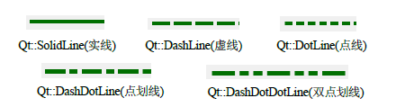
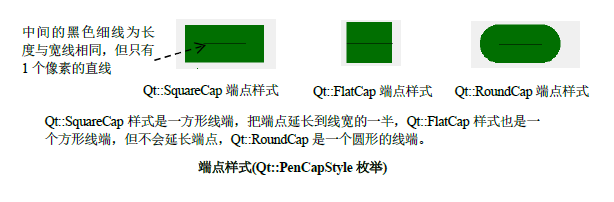
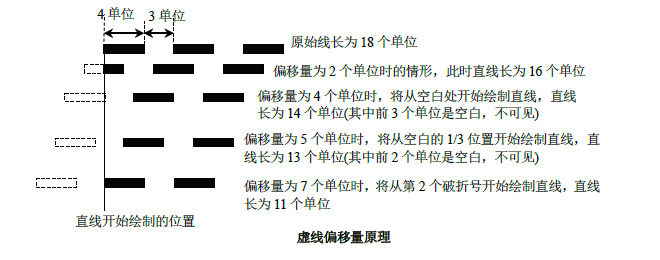

# QPen

## 基本原理

1. 画笔定义了怎么绘制线条的形状和轮廓，还定义了文本的颜色。
2. 画笔决定了线条的粗细、颜色、样式等属性
3. **默认画笔的宽度为1，颜色为黑色、端点样式为`Qt::SqureCap`、联接样式为`Qt::BevelJoin`**
4. 画笔样式 <br> 
5. 画笔端点样式 <br> 


## 函数

1. 构造函数
   1. `QPen()`
   2. `QPen(Qt::PenStyle style)`
   3. `QPen(const QColor &color)`
   4. `QPen(const QBrush &brush, qreal width, Qt::PenStyle style = Qt::SolidLine,Qt::PenCapStyle cap = Qt::SquareCap, Qt::PenJoinStyle join = Qt::BevelJoin)`
   5. `QPen(const QPen &pen)`
   6. `QPen(QPen &&pen)`
2. 端点样式
   1. `void Qt::PenCapStyle capStyle() const`
   2. `void setCapStyle(Qt::PenCapStyle style)`
3. 联接样式
   1. `void setJoinStyle(Qt::PenJoinStyle style)`
   2. `Qt::PenJoinStyle JoinStyle() const`
4. 斜接样式,斜接样式的延长距离，仅在联接样式为Qt::MitreJoin时有效
   1. `setMiterLimit(qreal limit)`
   2. `qreal miterLimit()`
5. 自定义虚线 
   * 设置画笔的虚线图案(即自定义虚线的样式),该函数必须指定偶数个正项，其中奇数项时破折号，偶数项时空格
   * 虚线图案的单位是以笔宽为单位，比如，宽度为11像素，若设置其长度为5，及5个笔宽单位这么长，因此线的长度为5*11 =55像素
   * 0宽度相当于是1像素宽的装饰笔
   * 端点样式也会影响虚线的长短
   * 设置该函数会隐式的把画笔样式转换为Qt::CustomDashLine
   1. `QVector<qreal> dashPattern() const`
   2. `void setDashPattern(const QVector<qreal> &pattern)`
6. 画笔偏移量 <br> 
   1. `qreal dashOffset() const`
   2. `void setDashOffset(qreal offset)`
7. 设置装饰笔(cosmetic pen),装饰笔是指具有恒定宽度的笔，使用装饰笔绘制的形状，可确保其轮廓在不同缩放因素下具有相同的厚度，默认为0宽度
   1. `bool icCosmetic() const`
   2. `void setCosmetic(bool cosmetic)`

## 示例

```cpp
#ifndef WIDGET_H
#define WIDGET_H

#include <QtWidgets>

class DrawPath :public QWidget
{
    Q_OBJECT
private:
    void init(){

    }
protected:
    void paintEvent(QPaintEvent *event) override{
        Q_UNUSED(event)

        QPainter painter;
        painter.begin(this);
        painter.setBrush(QBrush(Qt::green));


        QPen pen =painter.pen();
        /*自定义虚线*/
#if 1
        pen.setCosmetic(false);
        pen.setWidth(10);//设置笔宽
        pen.setDashPattern({
            5,5,5  //相当于10*5实线，10*5空白,10*5实线
        });
        pen.setDashOffset(0);
        qDebug() << pen.isCosmetic() <<pen.dashOffset();
#endif
        /*设置端点样式*/
#if 0
        pen.setCapStyle(Qt::RoundCap);
        painter.setPen(pen);
        painter.drawLine(100,0,100,100);
        pen.setCapStyle(Qt::SquareCap);
        painter.setPen(pen);
        painter.drawLine(200,0,200,100);
        pen.setCapStyle(Qt::FlatCap);
        painter.drawLine(300,0,300,100);
#endif

        /*设置连接点*/
#if 1
        QPainterPath path;
        path.addRect(50,50,50,50);

        pen.setJoinStyle(Qt::MiterJoin);
        painter.setPen(pen);
        painter.drawPath(path);

        pen.setJoinStyle(Qt::BevelJoin);
        painter.setPen(pen);
        path.translate(80,0);
        painter.drawPath(path);

        pen.setJoinStyle(Qt::RoundJoin);
        painter.setPen(pen);
        path.translate(80,0);
        painter.drawPath(path);

        pen.setJoinStyle(Qt::SvgMiterJoin);
        painter.setPen(pen);
        path.translate(80,0);
        painter.drawPath(path);

        pen.setJoinStyle(Qt::MPenJoinStyle);
        painter.setPen(pen);
        path.translate(80,0);
        painter.drawPath(path);
#endif


        painter.end();
    }

public:
    DrawPath(QWidget *p =nullptr) :QWidget(p){ init(); }
};

#endif // WIDGET_H

```