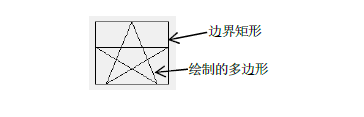
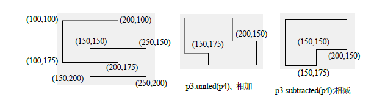

# QPolygonF

## 函数

### 构造函数

1. `QPolygonF()`
2. `QPolygonF(int size)`
3. `QPolygonF(const QVector<QPointF> &points)`
4. `QPolygonF(QVector<QPointF> &&v)`
5. `QPolygonF(const QRectF &rectangle)`
6. `QPolygonF(const QPolygon &polygon)`
7. `QPolygonF(const QPolygonF &polygon)`
8. `QPolygonF(QPolygonF &&other)`

### 普通函数

1. 平移所有的点
    1. `void translate(const QPointF &offset)`
    2. `void translate(qreal dx,qreal dy)`
    3. `QPolygonF translated(const QPointF $offset)`
    4. `QPolygonF translated(qreal dx,qreal dy)`
 1. 判断点point是否位于多边形内部
    1. `bool containsPiont(const QPointF &point,Qt::FillRule fillRule) const`
 2. 转换为整形版本
    1. `QPolygon toPolygon() const`
 3. 若多边形的起点与终点相等(称为闭合)
    1. `bool isClosed() const`
 4. 把该多边形与多边形other交换
    1. `void swap(QPolygonF &other)`
 5. 获取交集
    1. `QPolygonF intersected(const QPolygonF &r) const`
    2. `bool intersects(const QPolygonF &r) const`
 6. 返回多边形的边界矩形，若多边形为空，则返回QRectF(0,0,0,0)   
    1. `QRectF boundingRect() const`
 7. 返回此多边形的并集或差集   
    1. `QPolygonF united(const QPolygonF &r) const`
    2. `QPolygonF subtracted(const QPolygonF &r) const`