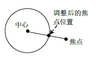
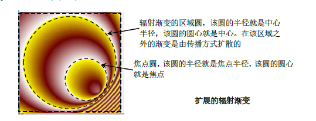

# QRadiaGradient

**由原点向焦点扩散的渐变**

##  函数

1. 构造函数(原点中心、中心半径、焦点、焦点半径) <br>  
   1. `QRadialGradient()`
   2. `QRadialGradient(const QPointF &center, qreal radius)`
   3. `QRadialGradient(qreal cx, qreal cy, qreal radius)`\
   4. `QRadialGradient(qreal cx, qreal cy, qreal radius, qreal fx, qreal fy)`
   5. `QRadialGradient(const QPointF &center, qreal centerRadius, const QPointF &focalPoint,qreal focalRadius)`
   6. `QRadialGradient(qreal cx, qreal cy, qreal centerRadius, qreal fx, qreal fy, qreal focalRadius)`
2. 辐射渐变的中心
   1. `QPointF center() const`
   2. `void setCenter(const QPointF &center)`
   3. `void setCenter(qreal x, qreal y)`
3. 辐射渐变的中心半径
   1. `qreal centerRadius() const`
   2. `qreal radius() const`
   3. `void setCenterRadius(qreal radius)`
   4. `void setRadius(qreal radius)`
4. 辐射渐变的焦点
   1. `QPointF focalPoint() const`
   2. `void setFocalPoint(const QPointF &focalPoint)`
   3. `void setFocalPoint(qreal x, qreal y)`
5. 辐射渐变的焦点半径
   1. `qreal focalRadius() const`
   2. `void setFocalRadius(qreal radius)`

## 示例

```cpp
#ifndef WIDGET_H
#define WIDGET_H

#include <QtWidgets>
#include <QRadialGradient>
class DrawGradient :public QWidget
{
    Q_OBJECT
private:
    void init(){

    }
protected:
    void paintEvent(QPaintEvent *event) override{
        Q_UNUSED(event)

        QPainter painter;
        painter.begin(this);

        QPen pen =painter.pen();
        QRadialGradient gradient(QPointF(166,166),155,//设置中心点为(220,100)，中心半径为55
                                 QPointF(100,100),40);//设置焦点为(222,222)，焦点半径为55
        painter.drawText(QPointF(166,166),"(166,166)");
        painter.drawText(QPointF(100,100),"(100,100)");
        painter.drawEllipse(QPointF(166,166),155,155);
        painter.drawEllipse(QPointF(100,100),40,40);
        painter.drawLines({QLineF(166,166,166,11),QLineF(100,100,100,60)});
        painter.drawPoints(QPolygonF() <<QPointF(166,166) << QPointF(100,100));


        /*两种设置渐变点的方式*/
#if 1
        gradient.setStops({
              QGradientStop(0,QColor(Qt::red)),
              QGradientStop(0.5,QColor(Qt::green)),
              QGradientStop(1.0,QColor(Qt::blue)),

        });
#else
        gradient.setColorAt(0,Qt::red);
        gradient.setColorAt(0.5,Qt::green);
        gradient.setColorAt(1.0,Qt::blue);
#endif
        gradient.setSpread(QGradient::RepeatSpread);//对锥形不起作用


        QBrush brush(gradient);
        painter.setOpacity(0.4);
        painter.setBrush(brush);
        painter.drawRect(1,1,333,333);
        /*设置连接点*/
#if 0
         //辐射颜色根据离QConicalGradient最近的颜色来
        QPainterPath path;
        path.addRect(50,50,100,100);

        pen.setJoinStyle(Qt::MiterJoin);
        painter.setPen(pen);
        painter.drawPath(path);

        pen.setJoinStyle(Qt::BevelJoin);
        painter.setPen(pen);
        path.translate(120,0);
        painter.drawPath(path);

        pen.setJoinStyle(Qt::RoundJoin);
        painter.setPen(pen);
        path.translate(120,120);
        painter.drawPath(path);

        pen.setJoinStyle(Qt::SvgMiterJoin);
        painter.setPen(pen);
        path.translate(0,120);
        painter.drawPath(path);

        pen.setJoinStyle(Qt::MPenJoinStyle);
        painter.setPen(pen);
        path.translate(240,0);
        painter.drawPath(path);
#endif
        painter.end();
    }

public:
    DrawGradient(QWidget *p =nullptr) :QWidget(p){ init(); }
};

#endif // WIDGET_H
```