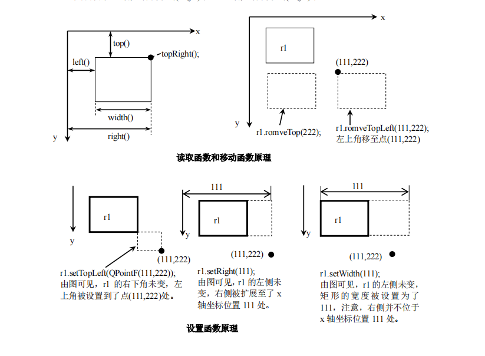
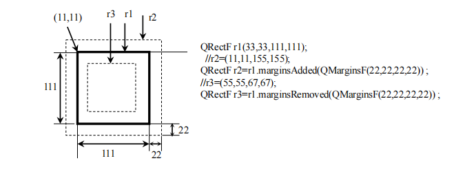

# QRectF

## 函数

### 设置位置和大小函数

1. 设置矩形
    1. `void setRect(qreal x, qreal y, qreal width, qreal height)`
    2.  `void setCoords(qreal x1, qreal y1, qreal x2, qreal y2)` coordinates:坐标
    3. `void getRect(qreal *x, qreal *y, qreal *width, qreal *height) const`
    4. `void getCoords(qreal *x1, qreal *y1, qreal *x2, qreal *y2) const`

### 判断矩形及点

1. 判断点或矩形是否在矩形内
    1. `bool contains(const QPointF &point) const;`
    2. `bool contains(const QRectF &rectangle) const`
    3. `bool contains(qreal x, qreal y) const`
2. 判断矩形是否为空
    1. 若宽或高小于0，返回true `bool isEmpty() const`
    2. 若宽或高都等于0,返回true `bool isNull()`
    3. `isEmpty() == !isValid()`
3. 返回一个规范化矩形(即有效矩形)，若 width() < 0，则交换左右角，若 height()<0，则交换上下角 `QRectF normalized() const`

### 平移矩形

1. 把矩形沿 x 轴移动距离 dx，沿 y 轴移动距离 dy，负值向反方向移动
    1. `void translate(qreal dx, qreal dy)`
    2. `void translate(const QPointF &offset)`
    3. `QRectF translated(qreal dx, qreal dy) const`
    4. `QRectF translated(const QPointF &offset) const`
2. 返回交换该矩形宽度和高度后的副本 `QRectF transposed() const`

### 调整矩形

1. 把矩形的左上角坐标加上(dx1, dy1);右下角坐标加上(dx2, dy2)
    1. `void adjust(qreal dx1, qreal dy1, qreal dx2, qreal dy2)`
    2. `QRectF adjusted(qreal dx1, qreal dy1, qreal dx2, qreal dy2) const`
2. 返回一个在现有矩形上增加或减小了边距 margins 的新矩形
    1. `QRectF marginsAdded(const QMarginsF &margins) const`
    2. `QRectF marginsRemoved(const QMarginsF &margins) const`

### 矩形的交集和并集

1. 矩形交集
    1.  `QRectF intersected(const QRectF &rectangle) const`
    2. `bool intersects(const QRectF &rectangle) const`
2. 矩形并集
    1. `QRectF united(const QRectF &rectangle) const`

### 浮点型和整型间的转换及其他

1. 返回完全包含该矩形的最小 QRect(整数)矩形
    1. `QRect toAlignedRect() const`
    2. `QRect toRect() const`
2. 从QRectF创建CGRect /*Core Graphics Rectangle*/
    1. `CGRect toCGRect() const`
    2. `static QRectF fromCGRect(CGRect rect)`