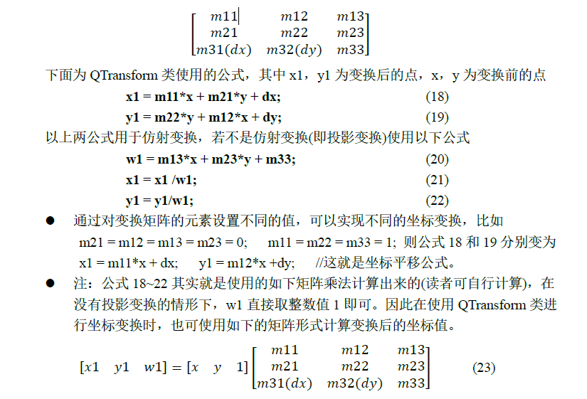

# QTransform

## 示例

1. `QTransform`类主要用于创建一个3*3的变换矩阵，该矩阵用于坐标系的2D变换。该类取代了`QMatrix`类(此类已过时)。
2. `QTransform`类通过操控变换矩阵来实现坐标变换,比如可进行矩阵的加、乘等运算，还可对矩阵类型进行判断(比如是否是满秩矩阵等)
3. `QTransform`类除了可通过操控其矩阵进行坐标变换外，还可以使用`QTransform`类中内置的基本交换函数等对坐标进行变换
4. 简单的坐标变换完全可以使用`QPainter`类中的基本坐标变换来完成
5. `QTransform`类的变换矩阵如下: <br> 
6. 把`QTransform`类的变换矩阵与坐标变换矩阵相比,可得出如下规律其中m31和m32用于平移，m11和m22用于缩放，m21和m12用于错切(shear),m13和m23用于投影变化

## 枚举

1. 变换矩阵类型
```cpp
enum TransformationType{
    TxNone      = 0x00,//无变换
    TxTranslate = 0x01,//平移
    TxScale     = 0x02,//缩放
    TxRotate    = 0x04,//旋转
    TxShear     = 0x08,//错切
    TxProject   = 0x10//投影
}
```

## 函数

1. `QPainter`中与`QTransform`相关的使用的函数
   1. 世界矩阵：世界矩阵是表示点的空间位置的矩阵。世界矩阵第一行是模型自身向右的向量，第二行是向上的，第三行是向前的，第四行是位置,matrix是当前矩阵，combine表示false取代当前矩阵，true组合矩阵
      1. `void setWorldMatrixEnabled(bool enable)`
      2. `bool worldMatrixEnabled() const`
      3. `void setWorldTransform(const QTransform &matrix,bool combine =false)`
      4. `void setTransform(const QTransform &transform,bool combine =false)`
      5. `const QTransform & transform() const`
      6. `const QTransform & worldTransform() const`
2. 构造函数
   1. `QTransform()`
   2. `QTransform(qreal m11,qreal m12,qreal m13,qreal m21,qreal m22,qreal m23,qreal m31,qreal m32,qreal m33 =1.0)`
   3. `QTransform(qreal m11, qreal m12, qreal m21, qreal m22, qreal dx, qreal dy)`
   4. `QTransform(const QMatrix &matrix)`
   5. `QTransform(QTransform &&other)`
   6. `QTransform(const QTransform &other)`
3. 设置和获取变换矩阵的元素
   1. `[ qreal m11() const;  qreal m12() const; qreal m13() const ]`
   2. `[ qreal m21() const;  qreal m22() const; qreal m23() const ]`
   3. `[ qreal m31() const;  qreal m32() const; qreal m33() const ]`
   4. `qreal dx() const; qreal dy() const`
   5. `void setMatrix(qreal m11, qreal m12, qreal m13, qreal m21, qreal m22, qreal m23, qreal m31,qreal m32, qreal m33)`
4. 内置的基本坐标变换函数
   1. 把坐标系沿轴axis逆时针旋转角度angle，并返回该矩阵的引用
      1. `QTransform &rotate(qreal angle,Qt::Axis =Qt::ZAxis)`
   2. 该函数与rotate()函数相同，但角度angle是以弧度指定的
      1. `QTransform &rotateRadians(qreal angle,Qt::Axis axis =Qt::ZAxis)`
    1. 缩放坐标系，并返回该矩阵的引用
       1. `QTransform &scale(qreal sx,sy)`
       2. `static QTransform fromScale(qreal sx,qreal sy)`
    2. 平移
       1. `QTransform &translate(qreal dx,qreal dy)`
       2. `static QTransform fromTranslate(qreal sx, qreal sy)`
    3. 错切变换
       1. `QTransform &shear(qreal sh, qreal sv)`
5. 对变换矩阵的判断
    1. 若矩阵表示旋转变换，则返回true。180度或360度的旋转被视为缩
       1. `bool isRotating() const`
    2. 若矩阵表示缩放变换，则返回true
       1. `bool isScaling() const`
    3. 若矩阵表示平移变换，则返回true
       1. `bool isTranslating() const`
    4. 若矩阵表示的是仿射(affine)变换，则返回true，否则返回false
       1. `bool isAffine() const`
    5. 返回此矩阵的转换类型，注意：返回的值是最大枚举值，比如若矩阵即是缩放又是错切，则返回的值是TxShear
       1. `TransformationType type() const`
6.  构建变换矩阵
    1. 重置为单位矩阵
       1. `void reset()`
    2. 创建一个把单位正方形映射到一个四边多边形quad的变换矩阵trans。若构造了QTransform则返回true，否则返回false
       1. `static bool squareToQuad(const QPolygonF &quad,QTransform &trans)`
    3. 创建一个把四边多边形quad映射到单位正方形的变换矩阵trans。若构造了QTransform则返回true，否则返回false
       1. `static bool quadToSquare(const QPolygonF &quad, QTransform &trans)`
    4.  把此矩阵作为仿射矩阵返回，注意：若为透视转换，则转换后将导致数据丢失
       2. `const QMatrix &toAffine() const`
7. 与线性代数有关的函数
   1. 返回该矩阵的伴随(adjoint)矩阵
      1. `QTransform adjoint() const`
   2. 返回该矩阵的行列式
      1. `qreal determinant() const`
   3. 返回此矩阵的转置矩阵
      1. `QTransform transposed() const`
   4. 返回此矩阵的逆矩阵，若矩阵是奇异的(非可逆的)，则返回的矩阵是单位矩阵，若参数invertible有效(即不为0)，则若矩阵可逆，则将其设置为true，否则将其设置为false
      1. `QTransform inverted(bool *invertible = Q_NULLPTR) const`
   5. 若矩阵是单位矩阵，则返回true
      1. `bool isIdentity() const;`
   6. 若矩阵是可逆的，则返回true
      1. `bool isInvertible() const`
8. 使用变换矩阵转换图形坐标 <br> 以下函数用于转换坐标,比如QPoint p1=matrix.map(point);表示把点使用变换矩阵matrix进行转换，然后返回该点的副本，相当于p1= point*matrix
   1. 转换点
      1. `QPointF map(const QPointF &p) const;`
      2. `QPoint map(const QPoint &point) const`
      3. `QPoint operator*(const QPoint &point, const QTransform &matrix)`
      4. `QPointF operator*(const QPointF &point, const QTransform &matrix)`
   2. 转换线
      1. `QLine map(const QLine &l) const`
      2. `QLineF map(const QLineF &line) const`
      3. `QLineF operator*(const QLineF &line, const QTransform &matrix)`
      4. `QLine operator*(const QLine &line, const QTransform &matrix)`
   3. 转换多边形
      1. `QPolygonF map(const QPolygonF &polygon) const`
      2. `QPolygon map(const QPolygon &polygon) const`
      3. `QPolygonF operator*(const QPolygonF &polygon, const QTransform &matrix)`
      4. `QPolygon operator*(const QPolygon &polygon, const QTransform &matrix)`
   4. 转换裁剪区域
      1. `QRegion map(const QRegion &region) const`
      2. `QRegion operator*(const QRegion &region, const QTransform &matrix)`
   5. 转换绘制路径
      1. `QPainterPath map(const QPainterPath &path) const`
      2. `QPainterPath operator*(const QPainterPath &path, const QTransform &matrix)`
   6. 将x,y的转换结果保存在tx,ty中
      1. `void map(qreal x, qreal y, qreal *tx, qreal *ty) const`
      2. `void map(int x, int y, int *tx, int *ty) const`
   7. 若变换矩阵有旋转或错切，则以上函数返回的是转换后的边界矩形。要获取其准确的矩形，需使用函数mapToPolygon()
      1. `QRectF mapRect(const QRectF &rectangle) const`
      2. `QRect mapRect(const QRect &rectangle) const`
      3. `QPolygon mapToPolygon(const QRect &rectangle) const`

## 示例

### 使用QTransform进行坐标转换

```cpp
#ifndef WIDGET_H
#define WIDGET_H

#include <QtWidgets>
#include <QRectF>
class aTransform :public QWidget
{
    Q_OBJECT
private:
    void init(){

    }
protected:
    void paintEvent(QPaintEvent *event) override{
        Q_UNUSED(event)

        QPainter painter;
        painter.begin(this);


        QBrush brush(QColor(255,255,1));
        painter.setBrush(brush);//设置画刷

        QRectF rect(0,100,55,55);//正方形
        painter.drawRect(rect);

        //变换1
        // (m11,  m12,  m21,  m22,  dx,  dy)
        // ( 1     y     x     1    20   0 )  向dx移动20 dy移动0
        QTransform &&transform = QTransform(1,0,0,1,20,0);
        transform.rotate(-60);//向逆时针旋转60度
        painter.setTransform(transform);//设置变换矩阵,combine为false时，代替变换矩阵
        painter.drawRect(rect);

        //变换2
        transform.reset();//重置为单位矩阵
        //[ m11=2,  m12=0,  m13=0]
        //[ m21=0,  m22=2,  m23=0]
        //[ m31=20,  m32=0,  m33=1]
        //向X、Y方向放大两倍 (x,y,height,width)都会放大,向X再平移20
        transform.setMatrix(2,0,0,0,2,0,20,0,1);
        painter.setTransform(transform);
        painter.drawRect(rect);

        //变换3
        //使用重载运算符进行矩阵乘法运算即先向X、Y方向放大两倍，再平移20，再平移150，旋转sinΘ =0.5
        transform = transform *(QTransform(0.5,0.5,-0.5,0.5,150,0));
        painter.setTransform(transform);
        painter.drawRect(rect);

        painter.end();
    }

public:
    aTransform(QWidget *p =nullptr) :QWidget(p){ init(); }
};

#endif // WIDGET_H
```

### QTransform::map()函数的使用

```cpp
#ifndef WIDGET_H
#define WIDGET_H

#include <QtWidgets>
#include <QRectF>
class aTransform :public QWidget
{
    Q_OBJECT
private:
    void init(){

    }
protected:
    void paintEvent(QPaintEvent *event) override{
        Q_UNUSED(event)

        QPainter painter;
        painter.begin(this);


        QBrush brush(QColor(255,255,1));
        painter.setBrush(brush);//设置画刷

        QRectF rect(0,100,50,100);//正方形
        painter.drawRect(rect);

        QLineF line(100,0,100,555);//线段
        painter.drawLine(line);

        QTransform &&transform = QTransform({1,0,0,
                                             0,1,0,
                                             100,0,1}); //使用列表初始化,向x方向平移50
        painter.setTransform(transform);
        painter.drawRect(rect);
        painter.drawLine(line);

        //逆时针旋转90度
        transform.rotate(90);
        rect = transform.mapRect(rect);//使用map函数相当于矩阵乘法
        line = line * transform ; //使用重载运算符

        //painter.setTransform(transform);
        painter.drawRect(rect);
        painter.drawLine(line);

        painter.end();
    }

public:
    aTransform(QWidget *p =nullptr) :QWidget(p){ init(); }
};

#endif // WIDGET_H
```

### 使用变换矩阵计算变换后的坐标值


```cpp
#ifndef WIDGET_H
#define WIDGET_H

#include <QtWidgets>
#include <QRectF>
class aTransform :public QWidget
{
    Q_OBJECT
private:
    void init(){

    }
protected:
    void paintEvent(QPaintEvent *event) override{
        Q_UNUSED(event)

        QPainter painter;
        painter.begin(this);


        QBrush brush(QColor(255,255,1));
        painter.setBrush(brush);//设置画刷

        QRectF rect(0,100,50,100);
        painter.drawRect(rect);

        QTransform transform;
        transform.translate(50,0);//向x平移50
        transform.rotate(-60);//以坐标原点轴逆时针旋转60
        QPolygon polygon = transform.mapToPolygon(rect.toRect());//获取经过变换矩阵计算后的多边形

        painter.drawPolygon(polygon);

        qDebug()<<transform;
        qDebug()<<polygon;

        painter.end();
    }

public:
    aTransform(QWidget *p =nullptr) :QWidget(p){ init(); }
};

#endif // WIDGET_H
```