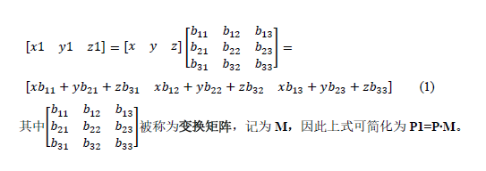
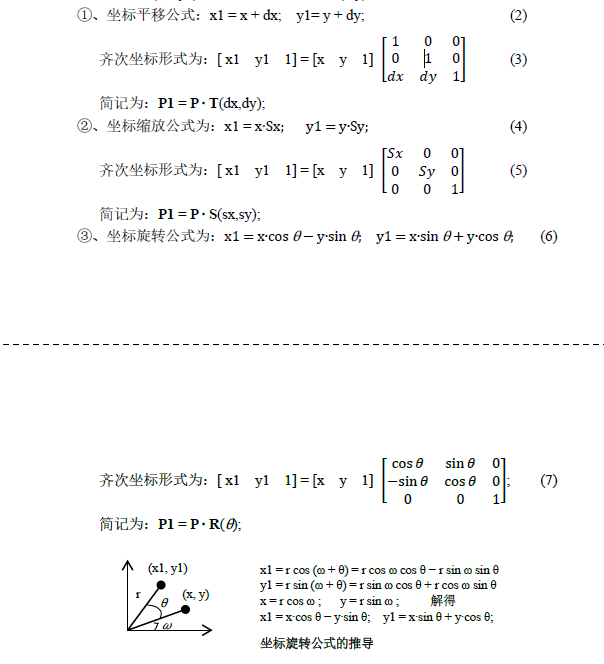

# 坐标变换(QTransform)

**需要数学知识和计算机图形学方面的知识**

## 基本数学知识

1. 齐次坐标
   1. 二维空间中的点可使用(x,y)表示，但在计算机图形学中使用齐次坐标表示点更为方便，齐次坐标把点表示为三元组，即在(x,y)基础上增加一维表示(x,y,w)，其中w是一个非零值
   2. 每个点有很多个不同的齐次坐标表示(只要其中一个时另一个倍数即可),比如(1,2,5),(2,4,10),(4.8.20)都是表示同一个点，通常会使用w去除齐次坐标，从而一个点被表示为(x/w,y/w,1),这样每一个二维坐标点都可以使用三维齐次坐标来表示
   3. 同理三维坐标(x,y,z),也可以使用四维齐次坐标表示为(x,y,z,1)
   4. 使用齐次坐标后，所有的坐标变换公式都可以使用如下矩阵相乘的形式来表示 
2. 坐标变换公式
   1. 以下各式中,dx和dy表示平移距离，Sx和Sy表示缩放系数，θ表示绕原点逆时针旋转的角度，P1(x1,y1)为坐标变换后的点,p(x,y)为坐标变换前的点
   2. 例如坐标 x1 = x + 0 +dx  // a=1 b =0 c =dx 
3. 坐标的复合变换: 即多个坐标变换序列的组合
   1. 连续平移变换(其结果是平移相加)
      1. 把点p平移至点p1再平移至p2,其平移公式的推导步骤为  $$P1 = P∙M1; P2 = P1∙M2 = P∙ M1∙M2$$ 由此推导过程可见，对复合的坐标变换系列，只需计算其变换矩阵即可，以上规则也适用于复杂的复合变换 $$P2 = P∙ T(t1x, t1y) ∙ T(t2x, t2y) = P∙ T(t1x+t2x , t1y+t2y)$$
   2. 连续缩放变换的结果就是缩放相乘 $$P1 = P∙ S(s1x, s1y) ∙ S(s2x, s2y) = P∙ S(s1x ∙ s2x, s1y ∙ s2y)$$
   1. 连续旋转的变换结果是旋转相加 $$P1 = P∙R(θ 1) ∙ R(θ 2) = P∙ R(θ 1 + θ 2)$$
4. 矩阵计算的注意事项:平移再旋转与选旋转再平移是不同的 $$ M1∙M2∙M3 = (M1∙ M2) ∙ M3 = M1∙ (M2 ∙ M3)$$ 但是不等于 $$M1∙M2 ≠ M2∙M1$$
5. 由此可见，只需给出变换矩阵，便可对其进行坐标变换，因此在计算机编程中，通常只需给出一个变换矩阵，然后给矩阵各元素赋予需要的值便可对其进行各种坐标变换
6. 仿射(affine)变换:平移、旋转、缩放、对称、错切这些变换都是仿射变换的特例，任何仿射变换总可以表示为几种变换的组合。
7. 投影变换：投影变换分为透视变换和平行变换

## 函数

1. 在`QPainter`类中的基本变换函数进行坐标变换
   1. 默认情况下，`QPainter`是在自己所关联的绘制设备的坐标系(通常为像素)上运行的，绘制设备默认坐标系的原点位于左上角，X向右增长，Y向下增长
   2. `QPainter`的变换矩阵(QTransform 类)上进行的变换，可使用`QPainter::worldTransform()`函数获取该变换矩阵
      1. 平移坐标
         1. `void translate(const QPointF &offset)`
         2. `void translate(const QPoint &offset)`
         3. `void translate(qreal dx,qreal dy)`
      2. 缩放坐标系
         1. `void scale(qreal sx,qreal sy)`
      3. 按顺时针旋转坐标,单位为angle
         1. `void rotate(qreal angle)`
      4. 使用(sh,sv)错切坐标
         1. `void shear(qreal sh,qreal sv)`
      5. 保存当前绘制器状态(把状态压入堆栈)，包括当前的坐标系
         1. `void save()`
      6. 恢复当前绘制器状态(从堆栈中弹出保存的状态)
         1. `void restore()`
      7. 重置所有坐标变换
         1. `void resetTransform`
      8. 返回从逻辑坐标转换为平台相关绘图设备的设备坐标矩阵，只有在平台相关句柄(Qt::HANDLE)上使用平台绘制命令才需要此函数
         1. `const QTransform &QPainter::deviceTransform() const`

## 函数

```cpp
#ifndef WIDGET_H
#define WIDGET_H

#include <QtWidgets>
#include <QRectF>
class DrawCroodinates :public QWidget
{
    Q_OBJECT
private:
    void init(){

    }
protected:
    void paintEvent(QPaintEvent *event) override{
        Q_UNUSED(event)

        QPainter painter;
        painter.begin(this);

        QBrush brush(Qt::red);
        painter.setBrush(brush);

        QRectF  rect(0,11,22,55);
        painter.drawRect(rect); //画第一个矩形
        painter.translate(50,100);//变换1 向(dx,dy)(50,100)平移
        painter.drawRect(rect); //画第一个矩形


        painter.save();//保存当前绘制器状态
        painter.translate(50,50);
        painter.scale(1,2); //向Y缩放两倍
        painter.rotate(-60);//逆时针旋转60°
        painter.drawRect(rect);//变换2

        painter.restore();//恢复绘制器状态
        painter.translate(100,0);
        painter.drawRect(rect);//变换3

        painter.translate(50,0);
        painter.rotate(-60);
        painter.scale(1,3);
        painter.drawRect(rect);//变换4

        painter.resetTransform();
        painter.setBrush(QBrush(Qt::yellow));
        painter.drawRect(rect.translated(20,20));//变换5

        painter.end();
    }

public:
    DrawCroodinates(QWidget *p =nullptr) :QWidget(p){ init(); }
};

#endif // WIDGET_H
```
