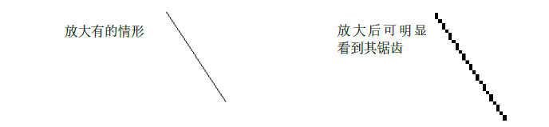
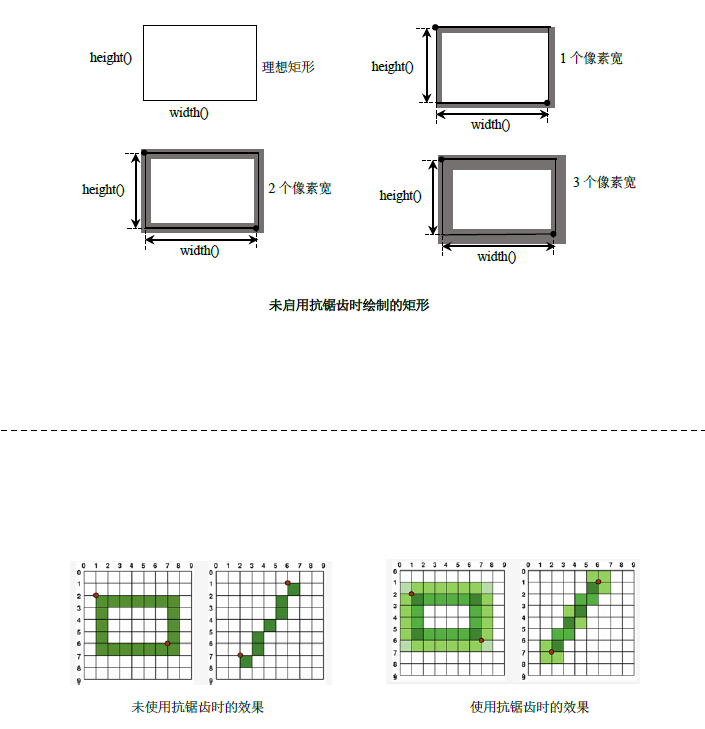

# 抗锯齿和图像合成

## 抗锯齿(Anti-aliased)

1. 计算机上的图像都是以像素为单位显示的，像素其实就是一个一个的小方块，因此显示出来的图像只有完全水平或垂直的直线才可能直的，对于斜线，在未放大的情况下，看起来可能是直线没有抗锯齿，但一旦放大就必然会带有锯齿现象 <br>  
2. 把用于减少锯齿的技术称为抗锯齿、反走样或反锯齿。抗锯齿的算法有很多种，但基本原理其实就是对轮廓线的像素设置不同的灰度值使其产生模糊的效果，从而减轻锯齿
3. 数学直线，是指在数学上的理想的直线，他是没有宽度的，然而实际上的图形，至少都需要占据一个像素的宽度
4. 当启用抗锯齿时，像素将在数学定义的点的两侧对称渲染
5. 未启用抗锯齿时的图形绘制原则 <br> 
   1. 当使用一个像素宽的笔绘制图形时，像素将在数学定义的点的右侧和下方
   2. 当使用偶数个像素宽的笔绘制图形时，像素将在数学定义的点的周围对称地渲染
   3. 当使用奇数个像素宽的笔绘制图形时，多余的像素将在数学定义的点的右侧和下方。这与在一个像素宽时类似
   
## 枚举

1. 描述渲染图像时的质量提示,QPainter默认是没有启动抗锯齿的

```cpp
enum RenderHint {
  Antialiasing = 0x01,//若有可能，则开启抗锯齿处理
  TextAntialiasing = 0x02,//若有可能，则文本启用抗锯齿
  SmoothPixmapTransform = 0x04,//表示使用平滑的像素图变换算法(如双线性)
  HighQualityAntialiasing = 0x08,
  NonCosmeticDefaultPen = 0x10,
  Qt4CompatiblePainting = 0x20
};
Q_FLAG(RenderHint)

Q_DECLARE_FLAGS(RenderHints, RenderHint)
Q_FLAG(RenderHints)
```

## 函数

1. 渲染提示
   1. `void setRenderHint(RenderHint hint, bool on = true)`
   2. `void setRenderHints(RenderHints hints, bool on = true)`
   3. `RenderHints renderHints() const`
   4. `bool testRenderHint(RenderHint hint) const`

## 示例

### 抗锯齿处理

```cpp
#ifndef WIDGET_H
#define WIDGET_H

#include <QtWidgets>
class aDrawImage :public QWidget
{
    Q_OBJECT
private:

    void init(){

    }
protected:
    void paintEvent(QPaintEvent *event) override{
        Q_UNUSED(event)
        QPainter painter;
        painter.begin(this);

        painter.drawLine(11,11,77,111); //未开启抗锯齿

        painter.setRenderHint(QPainter::Antialiasing);
        painter.drawLine(44,11,111,111);//开启抗锯齿

        painter.setRenderHint(QPainter::SmoothPixmapTransform);
        painter.drawLine(77,11,144,111);//开启双线性抗锯齿

        painter.end();
    }

public:
    aDrawImage(QWidget *p =nullptr) :QWidget(p){ init(); }
};

#endif // WIDGET_H
```