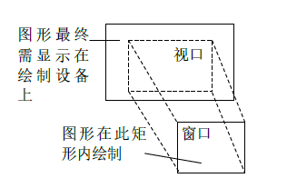
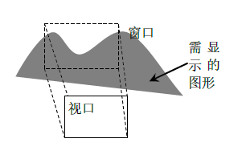
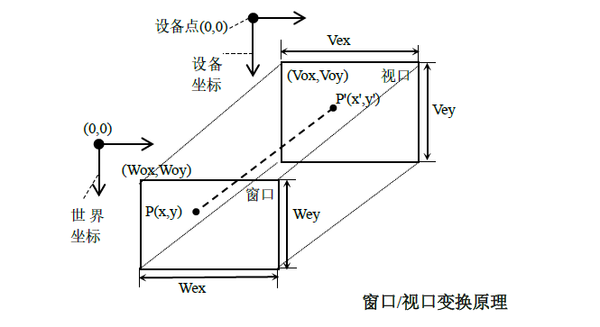

# 窗口/视口变换原理

**窗口全程为裁剪窗口**

## 基本原理

   
1. 在`QPainter`类中使用的函数
   1. 返回当前窗口/视口和世界变换的变换矩阵组合
      1. `QTransform combinedTransform() const`
   2. 是否启用窗口视口的转换
      1. `void setViewTransformEnabled(bool enable)`
      2. `bool viewTransformEnabled() const`
   3. 视口/窗口矩形获取和设置
      1. `QRect viewport() const`
      2. `QRect window() const`
      3. `void setViewport(const QRect &rectangle)`
      4. `void setViewport(int x, int y, int width, int height)`
      5. `void setWindow(const QRect &rectangle)`
      6. `void setWindow(int x, int y, int width, int height)`
2. 理解**逻辑**:"逻辑"一词具有"理论上的"意思，即就是"假想的"
3. 从图形绘制的方向理解窗口和视口 <br> 
   1. 窗口：就是一个逻辑上的(假想的)矩形，图形在这个假想的矩形上绘制，绘制完之后再把图像映射到视口上
   2. 视口：通常是与需要显示的设备相关联的(即绘制设备，比如QWidget部件，显示屏等)，然后图形才能显示出来
4. 从图形显示的方向理解窗口和视口 <br>  <br> **此处讲解的只是一种理论模型，实际实现时是否会裁剪图形，以及坐标变换是在窗口进行还是在视口进行，则视实际使用的绘图软件而不同**
   1. 假设需要显示图中阴影部分的图形，则，首先把图形映射到**窗口**，此时可对图形进行旋转、缩放、平移等操作。
   2. 然后把超出窗口之外的图形裁减掉(这就是为什么窗口全程为裁剪窗口的原因)，然后把图形映射到视口上显示出来。
   3. 若把视口理解为我们的眼睛，则视口和窗口的概念就很容易理解了。窗口的所有内容只有完全映射到视口的范围，才能被完全显示。
   4. 一个窗口的内容可以同事映射到多个视口，即可以从不同的视口去观察窗口中的内容。
   5. 在窗口到视口的映射中，还可以对图形进行缩放、平移等简单变换
5. 窗口/视口主要作用
   1. 绘制设备有以像素为单位的(比如显示器),也有以点为单位的(比如打印机),使用窗口/视口机制，可使绘图与绘制设备相互独立，我们只需在窗口绘图，而不需要关心底层绘制设备到底是什么，因为图形在窗口中绘制，因此窗口来自于真实世界。
6. 窗口/视口变换
   1. 因为计算机中图形的绘制和显示通常都是位于矩形区域之间的，因此窗口/视口变换就是矩形到矩形的变换
   2. 窗口/视口的变换原理:在窗口中被映射的点(x,y)与原点所围成的矩形区域，与被映射后在视口中的(x',y')与原点所围成的矩形区域，其所对应的长度之比，应与窗口和视口所形成的矩形长度之比相等，对于矩形区域的宽度原理相同 <br> 
   3. 窗口/视图范围:把窗口/视口的水平宽度和垂直宽度称为窗口/视口范围，比如窗口范围就是指的(Wex,Wey)，视口范围就是指的(Vex,Vey) 
 
        |变量名|意义|变量名|意义|
        |:--|:--|:--|:--|
        |(Wox,Woy)|窗口左上角坐标|(Vox,Voy)|视口左上角坐标|
        |Wex|窗口水平宽度|Vex|视口水平宽度|
        |Wey|窗口垂直宽度|Vey|视口垂直宽度|
        |(x,y)|窗口中被映射的点的坐标|(x',y')|被映射后在视口中的点的坐标|
7. 理解窗口/视口变换
   1. 视口中的设备就是指的实际的绘制设备，设备坐标和设备点是不会变的，其位置通常被设置为绘制设备的左上角，方向是x轴从左向右，y轴从上到下。
   2. 在视口中的坐标值x'，y'，Vox，Voy都是相对于设备坐标而言的，因此使用公式计算出来的坐标值x'，y'是相对于设备坐标而言的，因为窗口通常来自于现实世界，因此窗口中的坐标值是相对于世界坐标而言的

## 示例


### 视口/窗口映射

```cpp
#ifndef WIDGET_H
#define WIDGET_H

#include <QtWidgets>
#include <QRectF>
class aTransform :public QWidget
{
    Q_OBJECT
private:
    void init(){

    }
protected:
    void paintEvent(QPaintEvent *event) override{
        Q_UNUSED(event)

        QPainter painter;
        painter.begin(this);


        QBrush brush(QColor(255,255,1));
        painter.setBrush(brush);//设置画刷
        //绘制视口的x,y轴
        painter.drawLines({ QLineF(100,100,100,500),QLineF(100,100,500,100)});

        QPen pen;
        pen.setColor(QColor(111,1,1));
        pen.setWidth(10);
        pen.setCapStyle(Qt::FlatCap);

        painter.setPen(pen);
        painter.setViewport(100,100,500,500);

        painter.setWindow(0,0,1836,1836);

        painter.drawRect(0,0,500,500);//按照视口转换映射到视口中

        painter.end();
    }

public:
    aTransform(QWidget *p =nullptr) :QWidget(p){ init(); }
};

#endif // WIDGET_H
```

### 移动设备坐标系

```cpp
#ifndef WIDGET_H
#define WIDGET_H

#include <QtWidgets>
#include <QRectF>
class aTransform :public QWidget
{
    Q_OBJECT
private:
    void init(){

    }
protected:
    void paintEvent(QPaintEvent *event) override{
        Q_UNUSED(event)

        QPainter painter;
        painter.begin(this);


        QBrush brush(QColor(255,255,1));
        //painter.setBrush(brush);//设置画刷
        //绘制视口的x,y轴
        painter.drawLines({ QLineF(0,100,555,100),QLineF(100,0,100,555)});
        painter.drawRect(50,50,200,200);


        QPen pen;
        pen.setColor(QColor(111,1,1));
        pen.setWidth(10);
        pen.setCapStyle(Qt::FlatCap);
        painter.setPen(pen);

        painter.setViewport(50,50,200,200);
        painter.setWindow(-50,-50,200,200);

//        painter.drawLine(0,100,100,100);
        painter.drawRect(-50,-50,100,100);


        painter.end();
    }

public:
    aTransform(QWidget *p =nullptr) :QWidget(p){ init(); }
};

#endif // WIDGET_H
```