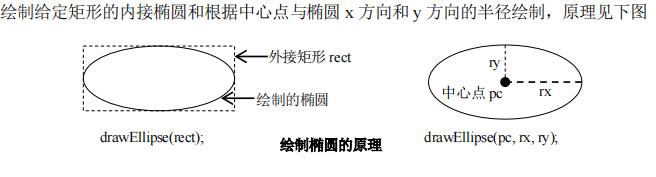
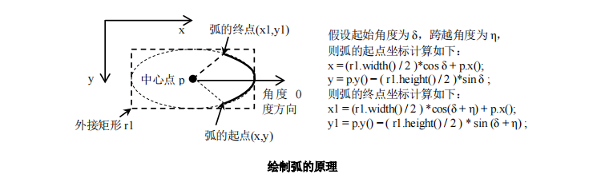

# 绘制椭圆、弧、扇形、圆形矩形

**QT绘制单位就是1/16度**

## 基本原理

1. QPainter类中的函数
    1. 绘制椭圆 
        1. `void drawEllipse(const QRectF &rectangle)`
        2. `void drawEllipse(const QRect &rectangle)`
        3. `void drawEllipse(int x,int y,int width,int height)`
        4. `void drawEllipse(const QPointF &center,qreal rx, qreal ry)`
        5. `void drawEllipse(const QPoint &center,qreal rx, qreal ry)`
    2. 绘制弧线,注意：startAngle，spanAngle 为指定角度的 1/16,角度逆时针方向为正 
        1. `drawArc(const QRectF &rectangle,int startAngle,int spanAngle)`
        2. `drawArc(const QRect &rectangle,int startAngle,int spanAngle)`
        3. `drawArc(int x,int y,int width,int height,int startAngle,int spanAngle)`
    3. 绘制弦
        1. `drawChord(const QRectF &rectangle,int startAngle,int spanAngle)`
        2. `drawChord(int x,int y,int width,int height,int startAngle,int spanAngle)`
        3. `drawChord(const QRect &rectangle,int startAngle,int spanAngle)`
    4. 绘制扇形(饼形)
        1. `drawPie(const QRectF &rectangle, int startAngle, int spanAngle)`
        2. `drawPie(int x, int y, int width, int height, int startAngle, int spanAngle)`
        3. `drawPie(const QRect &rectangle, int startAngle, int spanAngle)`
    5. 绘制带圆角矩形
        1. `drawRoundedRect(const QRectF &rect,qreal xRadius,qreal yRadius,Qt::SizeMode mode =Qt::AbsoluteSize)`
        2. `drawRoundedRect(int x,int y,int w,int h,qreal xRadius,qreal yRadius,Qt::SizeMode mode=Qt::AbsoluteSize)`
        3. `drawRoundedRect(const QRect &rect,qreal xRadius,qreal yRadius, Qt::SizeMode mode=Qt::AbsoluteSize)`
2. 绘制椭圆的原理 <br> 
3. 绘制弧、弦、扇形的原理 
    1. 弧是椭圆上的一段曲线，因此其绘制方法就是首先绘制一个椭圆，然后指定一段从起点到结束点的曲线作为弧
    2. 弧、弦、扇形的原理是相同的，只是形式不同
    3. 以弧为例讲解其绘制的原理 <br> 
        1. `drawArc(const QRectF &rectangle, int startAngle, int spanAngle)`
        2. 第一个参数`rectangle`用于指定起始角，`spanAngle`表示跨越角度
        3. `startAngle`和`spanAngle`是用于椭圆函数方程中的角。
            > $$ x=aCos\theta,y=bSin\theta (a表示椭圆x方向的半轴长，b表示椭圆y方向的半轴长)$$ 
        4. 也就是说startAngle并不是指弧的中心点与起点所连直线与x方向的夹角
        5. startAngle是用于计算弧起点的坐标的

## 示例

```cpp
#pragma once

#if _MSC_VER >= 1600
#pragma execution_character_set("utf-8")
#endif


#include <QtWidgets>
#include <math.h> //数学公式

class DrawArc :public QWidget
{
	Q_OBJECT
private:

	void init() {

	}
protected:
	void paintEvent(QPaintEvent *event) override {
		Q_UNUSED(event);
		QPainter painter;

		painter.begin(this);
		painter.setPen(QPen(Qt::black, 4));

		QRectF arcRectangle = QRectF(10, 10, 333, 111); //椭圆的外接矩形
		drawArc(painter, arcRectangle, 30, 99);

		painter.end();
	}
private slots:
	void drawArc(QPainter &painter,const QRectF &arcRectangle,int startAngle, int spanAngle) {
		QPointF arcCenter = arcRectangle.center();//椭圆的中心点


		/*使用虚线绘制外接矩形、宽高*/
		painter.save();//保存当前样式设置
		QPen pen = painter.pen();//获取画家画笔
		pen.setStyle(Qt::PenStyle::DotLine); //设置画笔样式虚线
		painter.setPen(pen);//设置画笔
		painter.drawRect(arcRectangle);//绘制外接矩形
		painter.drawLine(arcCenter,
			QPointF(arcCenter.x() + (arcRectangle.width() / 2), arcCenter.y()));
		painter.drawLine(arcCenter, QPointF(arcCenter.x(), arcRectangle.y()));

		qreal pi = 3.1415926535;
		qreal arc = pi / 180; //转换为弧度
		qreal angle = pi / 360; //转换为角度

		/*三角函数是以弧度形式指定的，而不是角度*/
		//绘制跟踪起点的直线,
		qreal x = (arcRectangle.width() / 2) * cos(startAngle * arc)//中心点到弧的dx距离
			+ arcCenter.x();
		qreal y = arcCenter.y()
			- (arcRectangle.height() / 2 * sin(startAngle * arc));
		QPointF startAnglePos(x, y);
		painter.drawLine(startAnglePos, arcCenter);

		//绘制跟踪弧终点的直线
		x = arcCenter.x()
			+ ((arcRectangle.width() / 2) * cos((spanAngle +startAngle) * arc));
		y = arcCenter.y()
			- (arcRectangle.height() / 2) *sin((spanAngle + startAngle) *arc);
		QPointF spanAnglePos(x, y);
		painter.drawLine(spanAnglePos, arcCenter);

		/*绘制红线弧形*/
		painter.restore();//获取保存的样式
		painter.save();
		painter.setPen(QPen(Qt::red, 4));

		/*Qt绘制单位为1/16度*/
		painter.drawArc(arcRectangle, startAngle * 16, spanAngle * 16);//绘制弧，需要使用实际度数x16
		painter.restore();//获取保存的样式
	}

public:
	DrawArc(QWidget *p = nullptr) : QWidget(p) { init(); }
};
```
