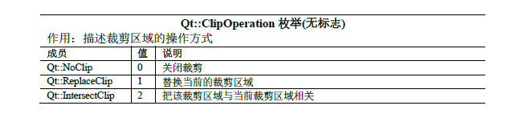

# 裁剪区域(QRegion)

## 基本原理

1. `QPainter`中使用到的函数   
   1. 把路径path或矩形rectangle或region设置为裁剪区域
      1. `void setClipPath(const QPainterPath &path, Qt::ClipOperation operation = Qt::ReplaceClip)`
      2. `void setClipRect(const QRectF &rectangle, Qt::ClipOperation operation = Qt::ReplaceClip)`
      3. `void setClipRect(const QRect &rectangle, Qt::ClipOperation operation = Qt::ReplaceClip)`
      4. `void setClipRect(int x, int y, int width, int height, Qt::ClipOperation operation = Qt::ReplaceClip)`
      5. `void setClipRegion(const QRegion &region, Qt::ClipOperation operation = Qt::ReplaceClip)`
   2. 以逻辑坐标返回当前裁剪区域
      1. `QRectF clipBoundingRect() const`
      2. `QPainterPath clipPath() const`
      3. `QRegion clipRegion() const`
   3. 启用裁剪
      1. `bool hasClipping() const`
      2. `void setClipping(bool enable)`
2. 裁剪区域的作用时把图形的绘制限制在裁剪区域中，裁剪区域通常是没有轮廓线的

