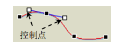

# 贝塞尔(Bezier)曲线

1. 贝塞尔曲线是应用于二维图形程序的数字曲线，在计算机中有着重要的应用，比如在绘图工具上常用的钢笔工具、TrueType字体(使用二次贝塞尔曲线描述其轮廓)等。
2. 贝塞尔曲线的特点是易于绘制和控制，通过调节贝塞尔曲线的控制点可以调节曲线的形状 
3. 贝塞尔曲线是由一系列多边折线(称为特征多边形)的个顶点(称为控制点)惟一的定义出来的曲线，在多边形的各顶点中，最后一点和第一点在曲线上，其余各点可用于定义曲线的形状及阶次，改变多边折线的顶点位置可改变曲线的形状。
