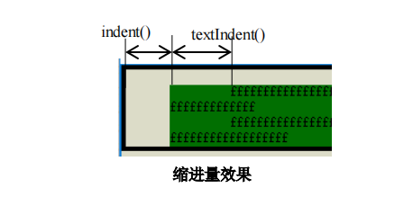
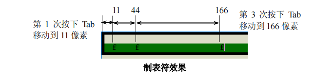

# QTextBlockFormat

**该类主要设置文本对齐方式、边距、文本方向、缩进等，背景色需使用父类的`setBackground()`设置**

## 枚举

```cpp
/*描述行间距*/
enum LineHeightTypes{
    SingleHeight,           /*默认行间距*/
    ProportionalHeight,     /*与行按比例设置行间距*/      
    FixedHeight,            /*设置固定像素的行间距*/
    MinimumHeight,          /*设置最小行间距(像素)*/
    LineDistanceHeight      /*在行之间添加指定像素高度的行间距*/
};
```

## 函数

### 对齐方式、断行

```cpp
/*返回块中文本的对齐方式*/
Qt::Alignment alignment() const; 
void setAlignment(Qt::Alignment alignment);
/*若块中的行不可断行，则返回 true。*/
bool nonBreakableLines() const; 
void setNonBreakableLines(bool b);
```

### 边距

```cpp
qreal topMargin() const;
qreal bottomMargin() const;
qreal leftMargin() const;
qreal rightMargin() const; 
void setTopMargin(qreal margin); 
void setBottomMargin(qreal margin)
void setLeftMargin(qreal margin)
void setRightMargin(qreal margin)
```

### 缩进量

*

```cpp
int indent() const; 
void setIndent(int in);
setTextIndent(qreal indent);
qreal textIndent() const;
```

### 制表符

*

```cpp
/*返回/设置文本块定义的制表符位置列表。*/
QList<QTextOption::Tab> tabPositions() const; 
void setTabPositions(const QList<QTextOption::Tab> &tabs);
```

### 行间距

```cpp
/*根据枚举 LineHeightTypes(即参数 heightType 的值)所描述的方式，设置块的行间距为height*/
void setLineHeight(qreal height, int heightType);
int lineHeightType() const;
qreal lineHeight() const;
/*把行行间距与 scriptLineHeight 和 scaling 进行计算后，返回计算后的行间距*/
qreal lineHeight(qreal scriptLineHeight, qreal scaling) const;
```

### 示例

```cpp
void test(QTextEdit *edit) {

	//制表符的位置
	typedef QTextOption::Tab TextTab;
	QList<TextTab> tabs = {
		/*按下tab依次移动*/
		TextTab(11,QTextOption::TabType::LeftTab),		/*第1个制表符位于像素11*/
		TextTab(44,QTextOption::TabType::RightTab),		/*第2个制表符位于像素44*/
		TextTab(100,QTextOption::TabType::CenterTab),	/*第3个制表符位于像素100*/
		TextTab(165,QTextOption::TabType::DelimiterTab)	/*第4个制表符位于像素165*/
	};

	QTextCursor cursor = edit->textCursor();
	cursor.movePosition(QTextCursor::Start);

	QTextBlockFormat format;
	format.setTabPositions(tabs);
	format.setBackground(Qt::red);

	cursor.insertBlock(format);
}
```