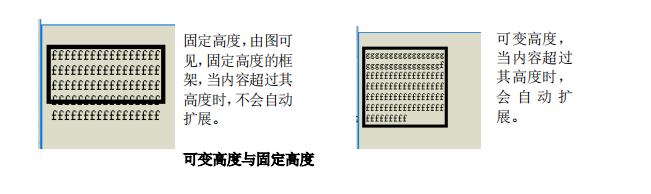
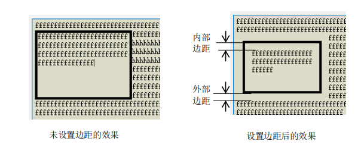
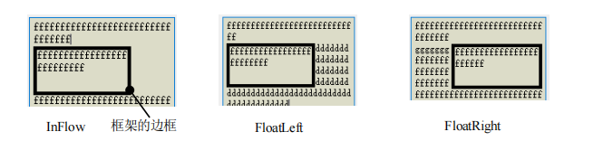

# QTextFrameFormat

框架格式指定框架在屏幕上的渲染和定位格式，不直接指定其中的文本格式的行为，仅对其子级的布局提供约束。主要设置了边框的高度、宽度、页边距和内部边距

## 函数

```cpp
/*位置*/
enum Position{
    InFlow,
    FloatLeft,
    FloatRight
}
/*描述框架的边框样式*/
enum BorderStyle {
    BorderStyle_None,       /*无*/
    BorderStyle_Dotted,     /*点线*/
    BorderStyle_Dashed,     /*虚线*/ 
    BorderStyle_Solid,      /*实线*/
    BorderStyle_Double,     /*双线*/
    BorderStyle_DotDash,    /*点划线*/    
    BorderStyle_DotDotDash, /*双点划线*/
    BorderStyle_Groove,     /*槽*/
    BorderStyle_Ridge,      /*脊线*/
    BorderStyle_Inset,      /*内凹*/
    BorderStyle_Outset      /*外凸*/
};

```

### 框架边框

```cpp
/*返回框架边框的宽度(像素)，默认为 0，要使边框可见，须设置值*/
qreal border() const;
void setBorder(qreal width);
/*返回/设置框架边框的画笔*/
QBrush borderBrush() const; 
void setBorderBrush(const QBrush &brush)
/*返回框架边框的样式*/
BorderStyle borderStyle() const; 
void setBorderStyle(BorderStyle style);
```

### 框架高度/宽度

*

```cpp
/*返回/设置框架的高度*/
QTextLength height() const; 
void setHeight(const QTextLength &height); 
void setHeight(qreal height);
/*设置框架的宽度(可设置可变宽度)*/
void setWidth(const QTextLength &width); //
void setWidth(qreal width)
QTextLength width() const;
```

### 框架外部边距/内部边距

* 

```cpp
/*返回/设置框架的外部边距(像素)*/
qreal margin() const; 
void setMargin(qreal margin);
qreal bottomMargin() const; 
void setBottomMargin(qreal margin); 
qreal topMargin() const
void setTopMargin(qreal margin)
qreal leftMargin() const; 
void setLeftMargin(qreal margin)
qreal rightMargin() const
void setRightMargin(qreal margin)
/*返回/设置框架的内部边距(像素)*/
qreal padding() const; 
void setPadding(qreal width)
```

### 分页策略和定位策略

* 

```cpp
/*返回框架/表格的分页策略，默认为 PageBreak_Auto*/
PageBreakFlags pageBreakPolicy() const;
void setPageBreakPolicy(PageBreakFlags policy)
/*返回框架相对于周围文本的定位策略。*/
Position position() const; 
void setPosition(Position policy)
```


