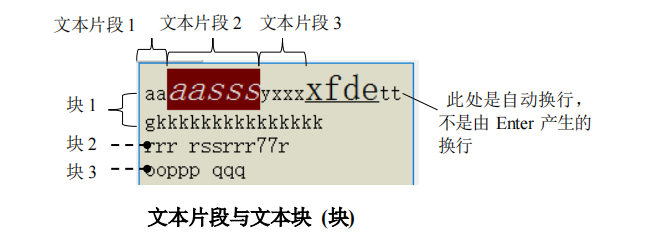
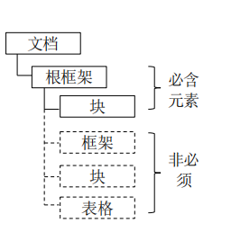
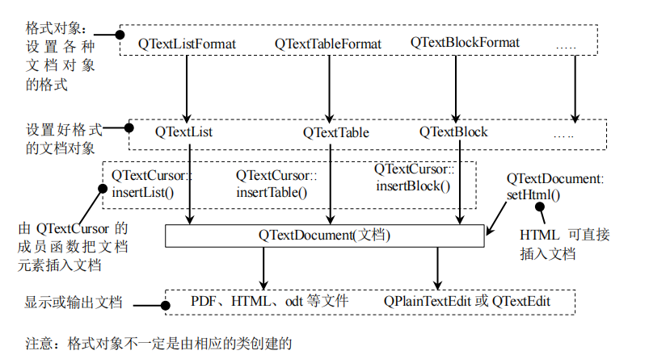

# Qt文本系统

* 富文本:就是指符合HTML语言规范的文本。Qt的富文本文档是指由段落、框架、表格、列表、HTML等组成的文本，因此范围更广。
* 文档(ducument)、文本(text)、段落(paragraph)、字符(char)、文档元素(文档对象)
* 文档由文本组成，文本由段落、文档元素组成，段落由字符组成。
* 文档元素: 文档(ducument)除了可以包含纯文本外，还可包含表格、列表、图像等其他对象，这些对象被称为文档元素
* 段落(paragraph): 理论上来讲,一个段落可以包含表格、列表、字符、图像等内容，但实际实现时可能只能包含纯文本

## Qt对文档的描述

* 文本片段简称片段(fragment):
    * 文本片段是指在一块文本中具有相同属性的一部分字符的集合
* 文本块简称快(block):
    * 块由换行符分割，在文本编辑器中每按一次Enter键就会产生一个文本块，即使该块什么内容也没有。注意：自动换行符产生的换行不会形成一个文本块(因为不是由换行符分割的)
    * 文本块将具有不同字符格式的文本片段组合在一起，并用于表示文档中的段落(即文本块就是段落，因此这两个概念时相同的)。因此文本块包含一个或多个文本片段
    * 文本块在Qt中用于分割其他文档元素，由于这个原因，文本块不能包含表格、框架等对象
* 文档对象(文档元素):
    * Qt的文档通常由常见的文档元素组成，即文本块、框架和列表、图像。在Qt中，每种文档元素都是用一个类进行描述，比如`QTextTable`类用于描述一个表格文档元素，由于这些类大多继承自`QTextObject`类，因此文档元素也被称为文档对象。
* 框架(frame):
    * 框架就是一个带边框的矩形，框架提供了文档各部分之间的逻辑分离，框架中可以包含文档的所有文档元素，也就是说框架中可以包含文本块、框架自身(即框架可以嵌套)、表格、列表、图像、HTML等。 
* 表格(table):
    * 表格时一种特殊类型的框架，由许多单元格组成，每个单元格可以包含更多的框架。文本块、表格等，也就是说表格可以嵌套。
* 图像(image):
    * 图像与文档中的其他元素不同，图像由图书格式的文本片段表示。这使得图像可以与周围的文本排成一行。
* 锚点(anchor):
    * 锚点是文档中某行的一个记号，类似于标签，用于链接到文档中的某个位置，当定义锚点后，我们可以创建直接跳至该锚点的链接，这样使用者就不需要不停滚动页面来寻找我们需要的信息了

## Qt文档的组织结构

* 每个文档都包含一个根框架，除跟框架之外的所有框架都具有父框架。
* 每个框架必须至少包含一个文本块(即使该文本块时空的)，以使文本光标可以在其中插入新的文档元素。
* 即使文本块不含任何信息，框架和表格的也总是由文本块分隔开来，这确保了可以在结构之间插入新元素。
* 每个框架至少包含一个文本块，以及零个或多个子框架。框架和表格主要用于对其他结构进行分组，而文本块才是实际上显示的信息。

## Qt文档的实现

* 文档元素:
    * 每种文档元素都使用一个类进行描述，比如`QTextTable`、`QTextBlock`等。
* 格式对象:
    * 每种文档元素的格式(大多是外观)都使用一种相对应的格式类进行描述，比如`QTextTable`使用`QTextTableFormat`类来描述其格式，这些描述格式的类都继承自`QTextFormat`类，我们将这些描述元素格式的类称为格式对象或格式类。
* QTextDocument类:
    * 现实中，不同的文档元素存储在一个文档中，因此，需要把使用由各种类描述的文档对象，使用一个类来统一存储，这个类就是`QTextDocumnet`,该类可以容纳各种文档元素，因此`QTextDocument`是文档元素的一个容器。
    * 由上一条原理可见，要编辑文档，首先需要创建一个`QTextDocumnet`对象，然后把设计好的其他文档元素(文档对象)添加到`QTextDocument`对象中。
* 编辑文档(QTextCursor类):
    * 虽然`QTextDocument`类是用来描述文档的，但是该类并不直接提供对文档元素修改的接口，也不提供添加其他文档元素(除HTML)的接口，因此要修改或向`QTextDocument`中添加文档元素，需要使用`QTextCursor`来完成。
    * `QTextCursor`类主要用于管理插入符，还能够把表格或列表等复杂对象插入到`QTextDocument`中,并处理选择。该类可以创建/删除选择、并检索文本的内容。
* 显示文档:
    * 在`QTextDocument`类的内容编辑好之后需要显示出来，有两种方式可显示`QTextDocument`中的内容。
    * 直接输出到文件，比如将`QTextDocument`输出为PDF、odt、ps、HTML等文件。使用这种方式显示`QTextDocument`文档是完全以编程的方式编辑`QTextDocument`文档，不够直观.
    * 使用QPlatinTextEdit或QTextEdit类来显示`QTextDocument`的内容并以所见即得得方式进行编辑，但除了纯文本外，图像、表格等元素，还是需要以编程的方式来进行编辑。
* 具体实现流程:
    * 
  