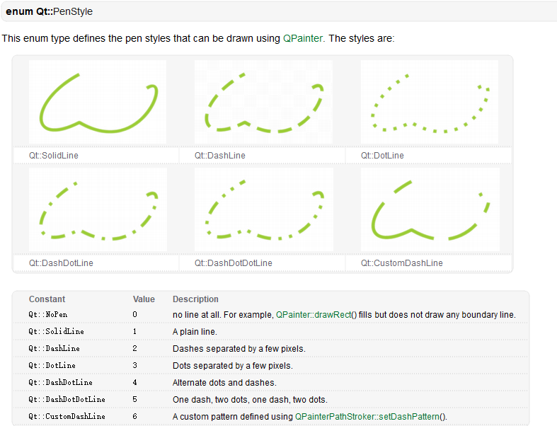
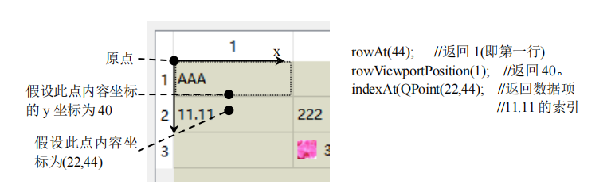

# QTableView

> Qt实现的标准视图之一，实现了一个显示表格的视图 

## 成员变量

```cpp
class QTableViewPrivate : public QAbstractItemViewPrivate
{
public:
    bool showGrid; //显示网格
    Qt::PenStyle girdStyle; //网格样式
    int rowSectionAnchor; //行部分的锚点
    int columnSectionAnchor; //列部分的锚点
    int columnResizeTimerID; //列调整定时器id
    int rowResizeTimerID;   //行调整定时器id
    QVector<int> columnsToUpdate;   
    QVector<int> rowsToUpdate;
    QHeaderView *horizontalHeader;
    QHeaderView *verticalHeader;
#if QT_CONFIG(abstractbutton)
    QWidget *cornerWidget;
#endif
    bool sortingEnabled; //是否排序
    bool geometryRecuesionBlock; //是否递归面积块
    QPoint visualCuror; //(行，列)单元格坐标跟踪跨导航
    QSpanCollection spans; //单元格的跨度
    enum class SearchDirection{ 
        Increasing, //增加
        Decreasing  //减少
    }
}

```

## 属性

> 

```cpp
/*是否绘制网格线*/
Q_PROPERTY(bool showGird READ showGird WRITE setShowGird)
/*描述绘制表格的画笔样式*/
Q_PROPERTY(Qt::PenStyle girdStyle READ gridStyle WRITE setGirdStyle)
/*是否启用排序*/
Q_PROPERTY(bool sortingEnabled RAED isSortingEnabled WRITE setSortingEnabled)
/*数据项的文字是否自动换行*/
Q_PROPERTY(bool wordWrap READ wordWrap WRITE setWordWrap)
/*是否启用表格左上角的按钮，点击该按钮会使表格视图的所有单元被选中*/
#if QT_CONFIG(abstractbutton)
Q_PROPERTY(bool cornerButtonEnabled READ isCornerButtonEnabled WRITE setCornerButtonEnabled)
#endif
```

## 构造函数

```cpp
QTableView(QWidget *parent = Q_NULLPTR)
    :QAbstractItemView(*new QTableViewPrivate, parent)
{
    Q_D(QTableView);
    d->init();
}

void QTableViewPrivate::init(){
    Q_Q(QTableView);

    q->setEditTriggers(editTriggers|QAbstractItemView::AnyKeyPressed);
    
    QHeaderView *vertical =new QHeaderView(Qt::Vertical,q);
    vertical->setSectionsClickable(true);
    vertical->setHighlightSections(true);
    q->setVerticalHeader(vertical);

    QHeaderView *horizontal = new QHeaderView(Qt::Horizontal, q);
    horizontal->setSectionsClickable(true);
    horizontal->setHighlightSections(true);
    q->setHorizontalHeader(horizontal);

        tabKeyNavigation = true;

#if QT_CONFIG(abstractbutton)
    cornerWidget = new QTableCornerButton(q);
    cornerWidget->setFocusPolicy(Qt::NoFocus);
    QObject::connect(cornerWidget, SIGNAL(clicked()), q, SLOT(selectAll()));
#endif
}
```

## 单元格大小

```cpp
/*把(row,column)处的单元格的跨度设置为跨越rowSpanCount行或columnSpanCount列*/
void setSpan(int row,int column,int rowSpanCount,int columnSpanCount);
/*以上函数表示返回(row, column)处单元格的行/列跨度，默认值为 1*/
int rowSpan(int row,int column) const;
int columnSpan(int row, int column) const;
/*删除视图中的所有行和列跨度*/
void clearSpans();
/*示设置和获取列 column 的宽度或行 row 的高度*/
void setColumnWidth(int column,int width);
int columnWidth(int column) const;
void setRowHeight(int row, int height);
int rowHeight(int row) const;
```

## 坐标(单元格位置)

* 以下函数的坐标都是指的内容坐标，即坐标原点位于视图的左上角(不含表头)
* 
```cpp
/*返回x或y方向上位于坐标x处的行或y处的列*/
int columnAt(int x) const;
int rowAt(int y) const;
/*返回列 column/行 row 的 x 坐标/y 坐标*/
int columnViewportPosition(int column) const;
int rowViewportPosition(int row) const;
/*这是对 QAbstractItemView::indexAt()的重新实现，表示返回内容坐标 pos 所在位置的数据项的索引*/
virtual QModelIndex indexAt(const QPoint &pos) const;
```

## 表头

```cpp
/*设置视图的水平和垂直标头*/
QHeaderView *horizontalHeader() const;
void setHorizontalHeader(QHeaderView *header);
QHeaderView *verticalHeader() const;
void setVerticalHeader(QHeaderView *header);
```

## 隐藏单元格

```cpp
bool isColumnHidden(int column) const;
void setColumnHidden(int column,bool hide);
bool isRowHidden(int row) const;
void setRowHidden(int row,bool hide);
```

## 排序

```cpp
/*按列 column 进行排序(升序/降序*/
void sortByColumn(int column,Qt::SortOrder order);
```

## 槽

### 公有槽函数

```cpp
/*根据委托的大小提示设置列 column/行 row 或所有列/行的大小*/
void resizeColumnToContents(int column);
void resizeColumnToContents();
void resizeRowToContents(int row);
void resizeRowToContents();
/*隐藏和显示列 column 或行 row*/
void hideColumn(int column);
void hideRow(int row);
void showColumn(int column);
void showRow(int row);
/*选择整列 column 或整行 row*/
void selectColumn(int column);
void selectRow(int row);
```

### 保护槽函数

```cpp
/*当添加或删除列/行时，调用以上槽函数，oldCount 表示之前的列数/行，newCount 表示新的列数/行数*/
void columnCountChanged(int oldCount,int newCount);
void rowCountChanged(int oldCount,int newCount);
/*更改视图中列 column/行 row 的索引，oldIndex 表示旧索引，newIndex 表示新索引*/
void columnMoved(int column,int oldIndex,int newIndex);
void rowMoved(int row,int oldIndex,int newHeigh);
/*更改列 column/ 行 的宽度 / 高 度 ， oldWidth/oldHeight 表示旧 的 宽 度 / 高 度 ，
newWidth/newHeight 表示新的宽度/高度*/
void columnResized(int column, int oldWidth, int newWidth)
void rowResized(int row, int oldHeight, int newHeight)
```
