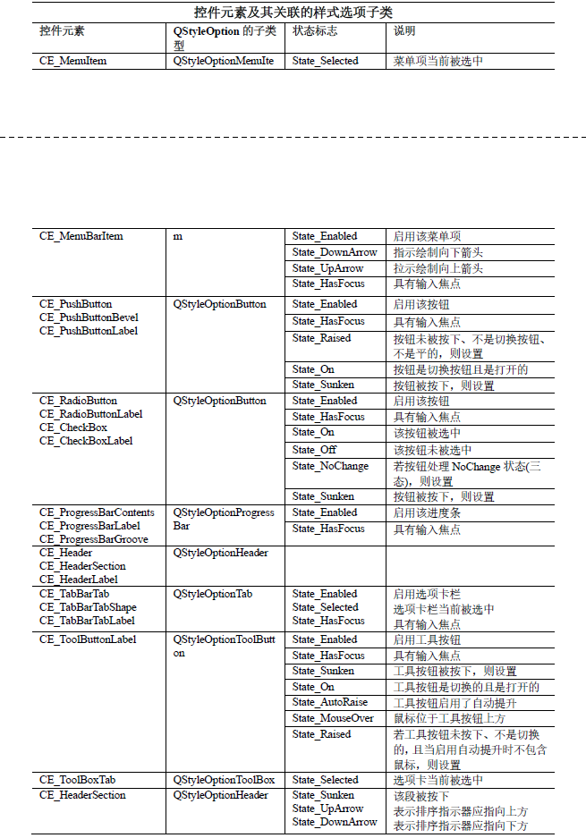

# QStyle 

## 样式基础

1. `QStyle`类继承自`QObject`，该类是一个抽象类
2. `QStyle`类描述了GUI的界面外观，Qt的内置部件使用该类执行几乎所有的绘制，以确保使这些部件看起来与本地部件完全相同
3. Qt内置了一系列样式，windows样式和fusion样式默认是可用的，而有些样式需在特定平台上才有用，比如windowsxp样式、windowsvisata样式、gtk样式、macintosh样式等
4. 使用步骤
   1. 使用`QStyleFactory::create()`静态函数创建一个QStyle对象
   2. 然后使用以下函数把样式设置到部件或程序中
      1. 使用`QWidget::setStyle()`函数为某个单个部件设置样式
      2. 使用`QApplication::setStyle()`静态函数来设置整个程序的样式
      3. 还可由应用程序的用户使用-style命令行选项指定样式，比如xxx -style windows
      4. 若未指定样式，Qt将选择与用户的平台或桌面环境最合适的样式
5. 绘制自定义部件外观的步骤分为三大模板:
   1. 样式元素：即指定需要绘制的图形元素(比如焦点框、按钮，工具栏等)。样式元素使用QStyle类中的一系列枚举(共有11个枚举)进行描述
   2. 样式选项：包含了需要绘制的图形元素的所有信息，比如包含了图形元素的文本、调色板等
   3. 样式绘制函数：即绘制图形元素的函数，这些函数是QStyle类的成员函数，比如drawControl()等
6. QStyle共有两个子类，分别为QCommonStyle，及QCommonStyle的子类QProxyStyle，在子类化时可根据情况进行选择，其中QCommonStyle类实现了部件的共同界面外观，因此该类实现的界面并不一定完整，而QProxyStyle类则实现了一个QStyle(通常是默认的系统样式)，因此该类的实现比较完整

## 样式元素

1. 样式元素是指需要绘制的图形元素，一个部件由多个样式元素组成，比如，当样式接收到绘制按钮的请求时，会绘制标签(文本和图标)，按钮斜面(Bevel)和焦点框 <br> 
2. 共有三种样式元素
   1. 原始元素:由QStyle::PrimitiveElement枚举描述，使用前缀“PE_”标识，原始元素通常由部件使用，包括框架、按钮斜面、旋转框、滚动条、组合框的箭头等，原始元素不能单独存在，是其他界面元素(如复杂控件和控件元素)的组成部分，不参与用户的交互，只是被动的绘制和显示
   2. 控件元素：由QStyle::ControlElement枚举描述，使用前缀“CE_”标识。控件元素执行某种操作或向用户显示一些信息，控件元素会与用户交互，可以是单独的部件(比如QPushButton)，也可以是其他部件的一部分(比如QScrollBar的滑块)。控件元素还可以由多个子元素组成，子元素仅用于计算边界区域，不能被绘制，然后便可在计算出的边界区域中绘制子元素，由多个子元素组成的控件使用QStyle::SubElement枚举描述(使用前缀SE_标识)
   3. 复杂控件元素：由QStyle::ComplexControl枚举描述，使用前缀“CC_”标识。复杂控件元素包含子控件，比如QSpinBox、QScrollBar、QToolButton等。复杂控件元素的子控件由QStyle::SubControl枚举定义(使用前缀SC_标识)
   4. 因为部件通常都是由矩形组成的，因此各种控件元素其实描述的就是一个矩形区域

## 枚举

1. 原始元素

```cpp
enum PrimitiveElement {

    /*按钮*/
  PE_PanelButtonCommand,//用于启动动作(action)的按钮，如QPushButton
  PE_FrameDefaultButton,//围绕默认按钮的边框
  PE_PanelButtonBevel,//带按钮斜面的通用面板
  PE_FrameButtonBevel,//按钮斜面的面板边框
  PE_IndicatorButtonDropDown,//下拉按钮的指示器，比如显示菜单的工具按钮
  PE_IndicatorCheckBox,//QCheckBox的开/关指示器
  PE_IndicatorRadioButton,//QRadioButton的开/关指示器


    /*行编辑器*/
  PE_PanelLineEdit,//QLineEdit的面板
  PE_FrameLineEdit,//行编辑器的边框

    /*其他*/
  PE_FrameFocusRect,//焦点边框指示器
  PE_Frame,//通用边框
  PE_Widget,//一个QWidget面板


    /*可停靠窗口*/
  PE_IndicatorDockWidgetResizeHandle,//调整可停靠窗口的手柄大小
  PE_FrameDockWidget,//可停靠窗口和工具栏的面板边框

    /*滚动区域*/
  PE_FrameWindow,//围绕MDI窗口或可停靠窗口的边框
  PE_PanelScrollAreaCorner,//在滚动区域右下角(或左下角)的面板


  PE_FrameGroupBox,
  PE_FrameMenu,
  PE_FrameStatusBar, // ### Qt 6: remove
  PE_FrameStatusBarItem = PE_FrameStatusBar,
  PE_FrameTabWidget,
  PE_FrameButtonTool,
  PE_FrameTabBarBase,

  PE_PanelButtonTool,
  PE_PanelMenuBar,
  PE_PanelToolBar,

  PE_IndicatorArrowDown,
  PE_IndicatorArrowLeft,
  PE_IndicatorArrowRight,
  PE_IndicatorArrowUp,
  PE_IndicatorBranch,
  PE_IndicatorViewItemCheck, // ### Qt 6: remove
  PE_IndicatorItemViewItemCheck = PE_IndicatorViewItemCheck,
  PE_IndicatorHeaderArrow,
  PE_IndicatorMenuCheckMark,
  PE_IndicatorProgressChunk,
  PE_IndicatorSpinDown,
  PE_IndicatorSpinMinus,
  PE_IndicatorSpinPlus,
  PE_IndicatorSpinUp,
  PE_IndicatorToolBarHandle,
  PE_IndicatorToolBarSeparator,
  PE_PanelTipLabel,
  PE_IndicatorTabTear,
  PE_IndicatorTabTearLeft = PE_IndicatorTabTear,


  PE_IndicatorColumnViewArrow,
  PE_IndicatorItemViewItemDrop,

  PE_PanelItemViewItem,
  PE_PanelItemViewRow, // ### Qt 6: remove

  PE_PanelStatusBar,

  PE_IndicatorTabClose,
  PE_PanelMenu,

  PE_IndicatorTabTearRight,

  // do not add any values below/greater this
  PE_CustomBase = 0xf000000
};
Q_ENUM(PrimitiveElement)
```

2. 控件元素

```cpp
enum ControlElement {
  CE_PushButton,
  CE_PushButtonBevel,
  CE_PushButtonLabel,

  CE_CheckBox,
  CE_CheckBoxLabel,

  CE_RadioButton,
  CE_RadioButtonLabel,

  CE_TabBarTab,
  CE_TabBarTabShape,
  CE_TabBarTabLabel,

  CE_ProgressBar,
  CE_ProgressBarGroove,
  CE_ProgressBarContents,
  CE_ProgressBarLabel,

  CE_MenuItem,
  CE_MenuScroller,
  CE_MenuVMargin,
  CE_MenuHMargin,
  CE_MenuTearoff,
  CE_MenuEmptyArea,

  CE_MenuBarItem,
  CE_MenuBarEmptyArea,

  CE_ToolButtonLabel,

  CE_Header,
  CE_HeaderSection,
  CE_HeaderLabel,

  CE_ToolBoxTab,
  CE_SizeGrip,
  CE_Splitter,
  CE_RubberBand,
  CE_DockWidgetTitle,

  CE_ScrollBarAddLine,
  CE_ScrollBarSubLine,
  CE_ScrollBarAddPage,
  CE_ScrollBarSubPage,
  CE_ScrollBarSlider,
  CE_ScrollBarFirst,
  CE_ScrollBarLast,

  CE_FocusFrame,
  CE_ComboBoxLabel,

  CE_ToolBar,
  CE_ToolBoxTabShape,
  CE_ToolBoxTabLabel,
  CE_HeaderEmptyArea,

  CE_ColumnViewGrip,

  CE_ItemViewItem,

  CE_ShapedFrame,

  // do not add any values below/greater than this
  CE_CustomBase = 0xf0000000
};
Q_ENUM(ControlElement)
```

3. 复杂控件元素

```cpp
enum ComplexControl {
  CC_SpinBox,
  CC_ComboBox,
  CC_ScrollBar,
  CC_Slider,
  CC_ToolButton,
  CC_TitleBar,
  CC_Dial,
  CC_GroupBox,
  CC_MdiControls,

  // do not add any values below/greater than this
  CC_CustomBase = 0xf0000000
};
Q_ENUM(ComplexControl)
```

4. 元素的状态

```cpp
enum StateFlag {
  State_None =                0x00000000,//无状态
  State_Enabled =             0x00000001,//启用部件
  State_Raised =              0x00000002,//按钮是凸起状态(通常为未被按下的状态)
  State_Sunken =              0x00000004,//部件被按下或是凹陷状态的
  State_Off =                 0x00000008,//部件未被选中
  State_NoChange =            0x00000010,//用于指示三态复选框
  State_On =                  0x00000020,//部件被选中
  State_DownArrow =           0x00000040,//显示向下箭头
  State_Horizontal =          0x00000080,//部件水平布局，比如，工具栏。
  State_HasFocus =            0x00000100,//部件具有焦点
  State_Top =                 0x00000200,//
  State_Bottom =              0x00000400,//
  State_FocusAtBorder =       0x00000800,//
  State_AutoRaise =           0x00001000,//工具按钮是否自动凸起
  State_MouseOver =           0x00002000,//部件位于鼠标下面
  State_UpArrow =             0x00004000,//是否显示向上箭头
  State_Selected =            0x00008000,//被选择
  State_Active =              0x00010000,//活动状态
  State_Window =              0x00020000,//
  State_Open =                0x00040000,//项目视图的树分支是否已打开
  State_Children =            0x00080000,//项目视图分支是否具有子项
  State_Item =                0x00100000,//项目视图是否应绘制水平分支
  State_Sibling =             0x00200000,//项目视图是否需要绘制垂直线
  State_Editing =             0x00400000,//可编辑
  State_KeyboardFocusChange = 0x00800000,//焦点是否可通过键盘更改(如，Tab、快捷键等)
#ifdef QT_KEYPAD_NAVIGATION
  State_HasEditFocus =        0x01000000,//部件当前具有编辑焦点
#endif
  State_ReadOnly =            0x02000000,//只读
  State_Small =               0x04000000,//small样式的Mac部件或按钮
  State_Mini =                0x08000000//mini样式的Mac部件或按钮
};
Q_ENUM(StateFlag)
Q_DECLARE_FLAGS(State, StateFlag)
```

## 函数

1. 绘制复杂控件元素 <br> 
   1. 该函数用于绘制复杂控件元素。表示使用painter，样式选项option绘制控件control
   2. widget参数是可选的，可用作绘制控件的辅助工具
   3. 参数option是指向QStyleOptionComplex对象的指针，可使用qstyleoption_cast()函数把该对象转换为正确的子类型
   4. option的rect成员变量必须位于逻辑坐标中，重新实现此函数，在调用QStyle::drawPrimitive()或QStyle::drawControl()函数之前，应使用QStyle::visualRect()函数把逻辑坐标转换为屏幕坐标
      1. `virtual void QStyle::drawComplexControl(ComplexControl control, const QStyleOptionComplex *option,QPainter *painter, const QWidget *widget = Q_NULLPTR) const = 0`
2. 绘制控件元素 <br> 
   1. `virtual void QStyle::drawControl(ControlElement element, const QStyleOption *option, QPainter *painter,const QWidget *widget = Q_NULLPTR) const = 0`
3. 绘制原始元素 <br> 
   1. `virtual void QStyle::drawPrimitive(PrimitiveElement element, const QStyleOption *option, QPainter *painter,const QWidget *widget = Q_NULLPTR) const = 0`
4. 使用 painter 根据对齐方式alignment，在矩形rectangle 中绘制像素图pixmap
   1. `virtual void QStyle::drawItemPixmap(QPainter *painter, const QRect &rectangle, int alignment,const QPixmap &pixmap) const`
5. 使用 painter，根据对齐方式alignment，调色板palette，在矩形rectangle 中绘制文本text。若指定了颜色角色textRole，则使用使用的颜色角色的调色板颜色绘制文本，参数enabled 用于指示是否启用该项。重新实现此函数时，enabled 参数应影响项目的绘制方式
   1. `virtual void QStyle::drawItemText(QPainter *painter, const QRect &rectangle, int alignment,const QPalette &palette, bool enabled, const QString &text,QPalette::ColorRole textRole = QPalette::NoRole) const`
6. 用于初始化部件的外观，会在部件创建完成之后，在第一次显示之前被调用，默认实现什么也不做。子类化QStyle时，可利用以上函数的调用时机，对部件的一些属性进行初始化
   1. `virtual void QStyle::polish(QWidget *widget)`
   2. `virtual void QStyle::polish(QApplication *application)`
   3. `virtual void QStyle::polish(QPalette &palette)`
   4. `virtual void QStyle::unpolish(QWidget *widget)`
   5. `virtual void QStyle::unpolish(QApplication *application)`
7. 返回复杂控件control的子控件subControl的矩形
   1. `virtual QRect subControlRect(ComplexControl control, const QStyleOptionComplex *option,SubControl subControl, const QWidget *widget = Q_NULLPTR) const = 0`
8. 返回由样式选项option所描述的控件的子元素element的矩形
   1. `virtual QRect subElementRect(SubElement element, const QStyleOption *option,const QWidget *widget = Q_NULLPTR) const = 0`

## 示例

```cpp
#ifndef WIDGET_H
#define WIDGET_H

#include <QtWidgets>
class aStyle :public QWidget
{
    Q_OBJECT
private:

    void init(){
        QStringList styles;
        styles <<"fusion" << "windows" <<"default" <<"windowsvista";
        QVBoxLayout *v =new QVBoxLayout(this);
        for (int i =0;i <styles.count();++i) {
            QPushButton *btn = new QPushButton(styles.at(i) +"样式");
            if(styles.at(i) !="default"){
                btn->setStyle(QStyleFactory::create(styles.at(i)));

            }
            v->addWidget(btn);
            qDebug() <<QStyleFactory::keys(); //返回有效键的列表，即该工厂可以为其创建样式的键
        }
    }

public:
    aStyle(QWidget *p =nullptr) :QWidget(p){ init(); }
};

#endif // WIDGET_H

```

### 子类化QCommonStyle实现自定义按钮样式

```cpp
#ifndef WIDGET_H
#define WIDGET_H

#include <QtWidgets>


#include <iostream>


class subCommonStyle :public QCommonStyle
{
    Q_OBJECT

private:
    typedef  void( subCommonStyle::*  func )(QPainter*,const QStyleOptionButton *) ;
    QMap<QStyle::State,func > functionCallback;
    QPen pen =QPen(Qt::green);
    QMap<QString,QBrush> colorTable={
        {"灰色",QColor(111,111,111)},
        {"红色",QColor(111,1,1)},
        {"白色",QColor(222,222,222)},
    };
    void init(){


        functionCallback ={
            {QStyle::State_MouseOver,&subCommonStyle::mouseover},
            {QStyle::State_Raised,&subCommonStyle::raised},
            {QStyle::State_Sunken,&subCommonStyle::sunken},
            {QStyle::State_HasFocus,&subCommonStyle::hasfocus},

        };
    }

    void mouseover(QPainter *painter,const QStyleOptionButton *option) {
        painter->fillRect(option->rect,colorTable["红色"]);
    }
    void raised(QPainter *painter,const QStyleOptionButton *option) {
        painter->fillRect(option->rect,colorTable["白色"]);
    }
    void sunken(QPainter *painter,const QStyleOptionButton *option) {
        painter->fillRect(option->rect,colorTable["灰色"]);
    }
    void hasfocus(QPainter *painter,const QStyleOptionButton *option) {
        painter->save();
        pen.setWidth(4);
        pen.setStyle(Qt::DashLine);
        painter->setPen(pen);
        painter->drawRect(option->rect.adjusted(1,1,-2,-2));
        painter->restore();
    }


protected:
    void drawControl(ControlElement element, const QStyleOption *opt,
                     QPainter *p, const QWidget *w = nullptr) const override{


        //因为绘制的是按钮需要将QStyleOption转换为QStyleOptionButton
        const QStyleOptionButton *option = qstyleoption_cast<const QStyleOptionButton*>(opt);
        QString text = "自定义:" + option->text;

        auto keys =functionCallback.keys();
        for(int i=0;i <keys.count();++i){
            if(keys.at(i) & option->state){
                const func function =functionCallback.value(keys.at(i));
    //            (this->* function)(p,option);
                (const_cast<subCommonStyle *>(this)->* function)(p,option);
            }
        }
        p->drawText(option->rect,text);

    }
    void polish(QWidget *widget) override{
        widget->setAttribute(Qt::WA_Hover); //设置这个属性后鼠标离开会产生绘图事件
    }
    void unpolish(QWidget *widget) override{
        widget->setAttribute(Qt::WA_Hover,false);
    }

public:
    subCommonStyle() { init(); }

};


#endif // WIDGET_H
```


### 子类化QCommonStyle实现自定义微调按钮样式

```cpp
#ifndef WIDGET_H
#define WIDGET_H

#include <QtWidgets>


#include <iostream>


class subCommonStyle :public QCommonStyle
{
    Q_OBJECT

private:
    typedef  void( subCommonStyle::*  func )(QPainter*,const QStyleOptionButton *) ;
    QMap<QStyle::State,func > functionCallback;
    QPen pen =QPen(Qt::green);
    QMap<QString,QBrush> colorTable={
        {"灰色",QColor(111,111,111)},
        {"红色",QColor(111,1,1)},
        {"白色",QColor(222,222,222)},
    };
    void init(){

    }


protected:
    //绘制复杂控件
    //如果不是复杂控件不会进到这个函数当中
    void drawComplexControl(ComplexControl cc, const QStyleOptionComplex *opt,
                            QPainter *p, const QWidget *w = nullptr) const override{

        //绘制的是spinbox类型
        auto option =qstyleoption_cast<const QStyleOptionSpinBox *>(opt);

        qDebug() <<option->state; //查看状态

        //获取微调按钮的向上和向下和文本编辑区域的矩形大小
        QRect UpRect = subControlRect(cc,option,QStyle::SC_SpinBoxUp,w);
        QRect DownRect = subControlRect(cc,option,QStyle::SC_SpinBoxDown,w);
        QRect TextRect = subControlRect(cc,option,QStyle::SC_SpinBoxEditField,w);


        //填充向上和向下箭头的颜色
        p->fillRect(UpRect.x(),UpRect.y(),UpRect.width()
                    ,UpRect.height() +DownRect.height(),colorTable["灰色"]);

        //向上箭头的路径
        QPainterPath upPath;
        upPath.moveTo(UpRect.x() + UpRect.width() /2,UpRect.y());
        upPath.lineTo(UpRect.bottomRight());
        upPath.lineTo(UpRect.bottomLeft());
        upPath.closeSubpath();
        p->drawPath(upPath);


        //向下箭头
        QPainterPath downPath;
        downPath.moveTo(DownRect.x(),DownRect.y());
        downPath.lineTo(DownRect.topRight());
        downPath.lineTo(DownRect.bottomLeft().x() +DownRect.width()/2,DownRect.y() +DownRect.height());
        downPath.closeSubpath();
        p->drawPath(downPath);

        auto state =option->state;
        if(state & QStyle::State_Sunken){//被按下的时候
            QPoint cursorPos = w->mapFromGlobal(QCursor::pos());//转换为全局的坐标
            p->save();
            p->setBrush(colorTable["红色"]);
            if(UpRect.contains(cursorPos)){
                p->drawPath(upPath);
            }else if(DownRect.contains(cursorPos)){
                p->drawPath(downPath);
            }
            p->restore();
        }
        if(state & QStyle::State_Raised){//未被按下的时候
            p->save();

            p->restore();
        }
        if(state & QStyle::State_HasFocus){//获得焦点
            p->save();
            p->setPen(pen); //绿色画笔
            p->drawRect(TextRect.adjusted(-1,-1,UpRect.width(),1));
            p->restore();
        }
    }
//    void polish(QWidget *widget) override{
//        widget->setAttribute(Qt::WA_Hover); //设置这个属性后鼠标离开会产生绘图事件
//    }
//    void unpolish(QWidget *widget) override{
//        widget->setAttribute(Qt::WA_Hover,false);
//    }

public:
    subCommonStyle() { init(); }

};


#endif // WIDGET_H
```