# QStyleOption子类

**`QStyleOption`及其子类描述了绘制图形元素所需的一些信息，这些信息存储在公有的成员变量中**

1. **QStyleOption**   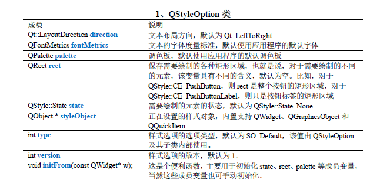
2. **QStyleOptionButton**   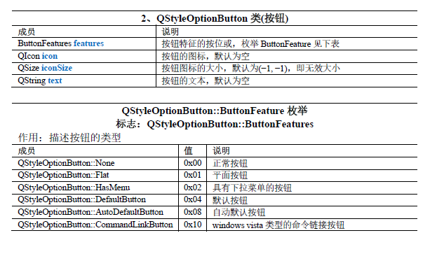
3. **QStyleOptionFocusRect**   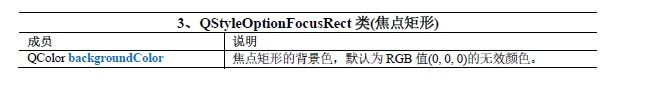
4. **QStyleOptionFrame**   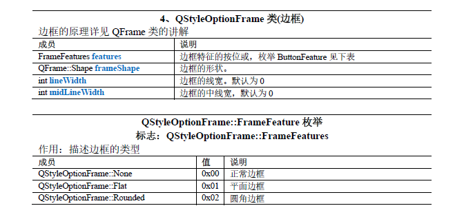
5. **QStyleOptionProgressBar**   
6. **QStyleOptionRubberBand**   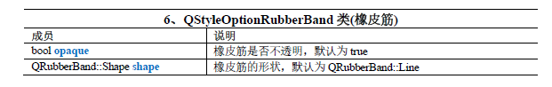
7. **QStyleOptionTab**   
8. **QStyleOptionTabBarBase**   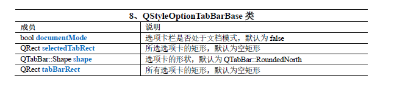
9. **QStyleOptionTabWidgetFrame**   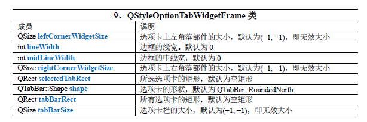
10. **QStyleOptionDockWidget**   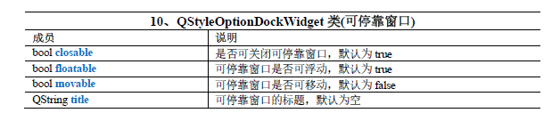
11. **QStyleOptionToolBar**   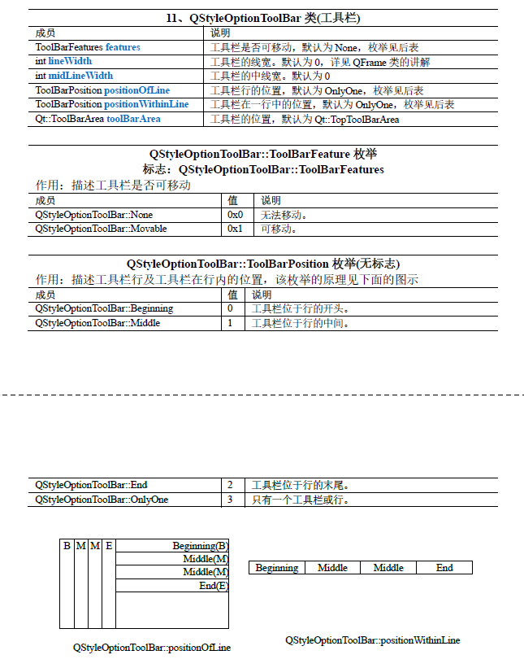
12. **QStyleOptionToolBox**   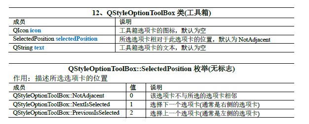
13. **QStyleOptionMenuItem**   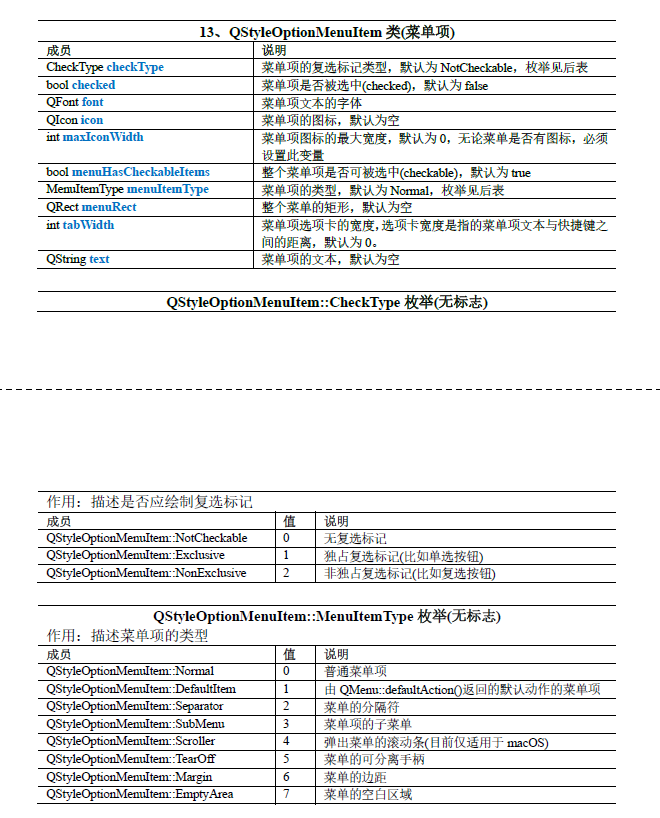
14. **QStyleOptionHeader**   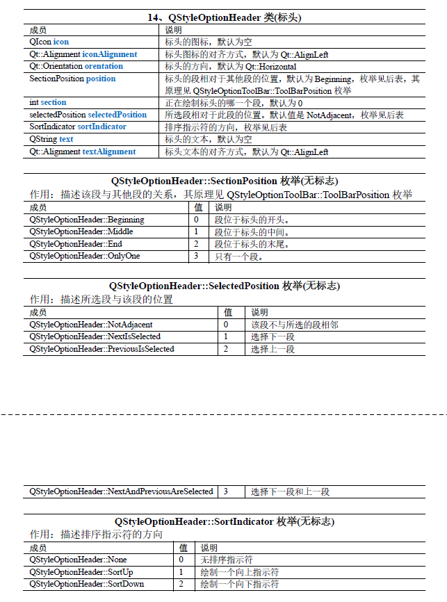
15. **QStyleOptionViewItem**   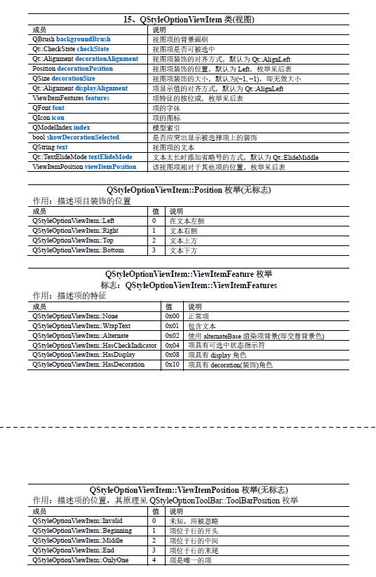
16. **QStyleOptionComplex**   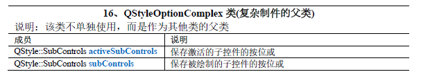
17. **QStyleOptionComboBox**   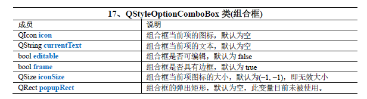 
18. **QStyleOptionSpinBox**   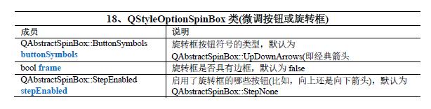 
19. **QStyleOptionSlider**   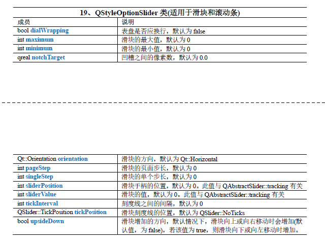
20. **QStyleOptionSizeGrip**   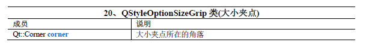
21. **QStyleOptionTitleBar**   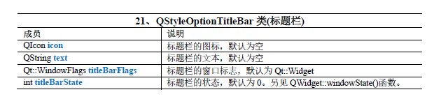
22. **QStyleOptionGroupBox**   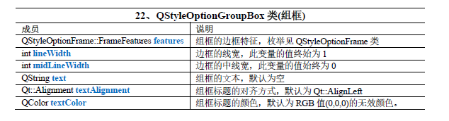
23. **QStyleOptionToolButton**   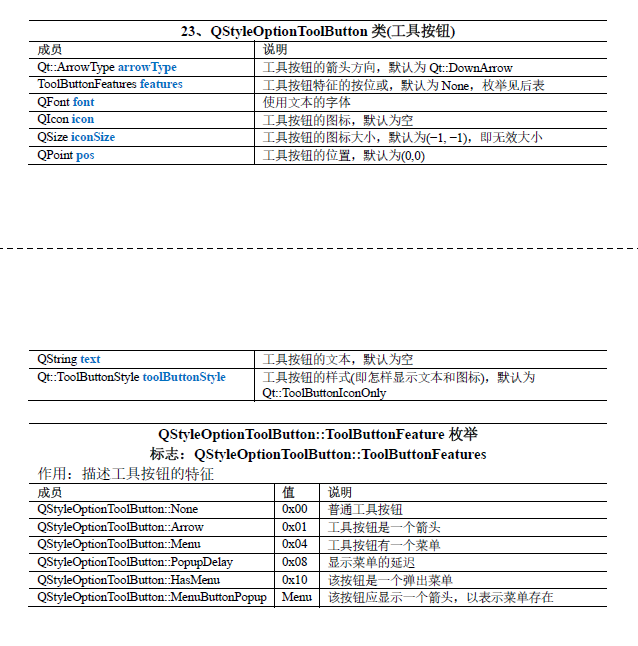