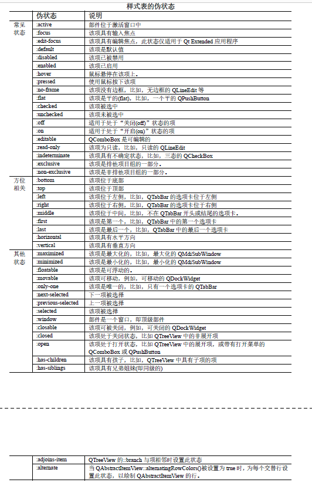

# 样式表

1. Qt样式表是另一种自定义部件外观机制。Qt样式表的术语、语法几乎与层叠样式表CSS(Cascading Style Sheets)相同。
2. 使用样式表和调色板(QPalette)相比，样式表更加强大，因为使用调色板设置的外观，并不能保证在所有样式中都能正常的工作，但样式表就不受这样的限制。且使用样式表可以更方便的设置界面的外观，而不需要去子类化QStyle类

## 样式表基本语法

1. Qt样式表通常不区分大小写，除了类名、对象名和Qt属性名称之外
2. 基本语法规则
   1. 样式表是由**选择器(selector)**和**声明(declaration)**两部分组成。
      1. 选择器：指定了受影响的部件
      2. 声明：指定要设置的属性
      3. `QPushButton{color:blue}`: 其中`QPushButton`是选择器，`{color: blue}`是声明，`color`是需要设置的属性，blue是属性的值。以上语句表明，`QPushButton`及其子类应使用blue(蓝色)作为其前景色
   2. 指定多个选择器
      1. 可以同时声明多个选择器，选择器使用逗号进行分割
   3. 指定多个属性
      1. 可以指定多个属性，使用分号进行分割
   4. 为含有多个值的属性指定多个值时使用空隔分隔
      1. `QLineEdit{border: 2px solid red}`：相当于`QLineEdit{ border-width: 2px;border-style:solid;border-color:red }`

## 选择器

1. 全局选择器
   1. `*`:
      1. 匹配所有部件
2. 类型选择器
   1. `QWidget`:
      1. 匹配QWidget及其子类的实例
3. 属性选择器
   1. QPushButton[flat = "false]：
      1. 匹配QPushButton属性flat属于false的实例
      2. 方括号内的属性是指Qt属性(即部件的属性)
      3. 此选择器也可用于测试动态属性(setProperty()函数)
      4. 也可以使用~= 代替 = 来测试QStringList类型的Qt属性是否包含给定的QString
      5. 如果Qt属性的值在样式表设置后发生更改，则可能这两个按钮的背景色都被设置为了红色此按钮的背景色被设置为了黄色此按钮的背景色未被设置需要强制重新计算样式表，其方法是取消样式表并重新设置它。
4. 类型选择器
   1. .QPushButton ：
      1. 匹配 QPushButton 但不匹配其子类的实例，这相当于`*[class~="QPushButton"]`
5. ID选择器
   1. QPushButton#AAA
      1. 匹配对象名(objectName 属性)为AAA 的所有QPushButton 实
例
6. 后代选择器
   1. QWidget QPushButton:
      1. 匹配 QWidget 的后代(子，孙子等)的所有QPushButton 实例
7. 子对象选择器
   1. QWidget > QPushButton
      1. 匹配 QPushButton 实例，它们是QWidget 的直接子部件

## 子控件

>  复杂控件通常包含一系列子控件，比如QComboBox的下拉按钮就是子控件，还有QSpinBox的向上/向下箭头等。对复杂控件使用样式表设置外观，可能需要访问其子控件。样子表中子控件以“::”符号开头
> QScrollBar、QComboBox 等部件的一个属性或子控件是自定义的，通常还要自定义其他属性和子控件。比如，单独使用QScrollBar 的子控件不会产生效果，需与滚动条的属性配合使用

1. 滑动条、滑块相关
   1. ::handle
      1. QScrollBar、QSplitter、QSlider 的手柄(滑块)
   2. ::groove
      1. QSlider 的凹槽
   3. ::comer
      1. QAbstractScrollArea 中两个滚动条之间的角落
   4. ::add-line
      1. QScrollBar 增加行的按钮，即按下该按钮滚动条增加一行
   5. ::add-page
      1. QScrollBar 在手柄(滑块)和增加行之间的区域
   6. ::sub-line
      1. QScrollBar 减少行的按钮，即按下该按钮滚动条减少一行
   7. ::sub-page
      1. QScrollBar 在手柄(滑块)和减少行之间的区域
2. 箭头相关
   1. ::down-arrow
      1. QComboBox、QHeaderView 排序指示器、QScrollBar、QSpinBox 的向下箭头
   2. ::down-button
      1. QScrollBar 或QSpinBox 的向下按钮
   3. ::up-arrow
      1. QHeaderView(排序指示器)、QScrollBar、QSpinBox 的向上箭头
   4. ::up-button
      1. QSpinBox 的向上按钮
   5. ::left-arrow
      1. QScrollBar 的左箭头
   6. ::right-arrow
      1. QMenu 或QScrollBar 的右箭头
3. 模型/视图
   1. ::branch
      1. QTreeView 的分支指示符
   2. ::section
      1. QHearderView 的段
   3. ::text
      1. QAbstractItemView 的文本
4. 其他
   1. ::chunk
      1. QProgressBar 的进度块
   2. ::drop-down
      1. QComboBox 的下拉按钮
   3. ::indicator
      1. QAbstractItemView、QCheckBox、QRadioButton、QMenu(可被选中的)、QGroupBox(可被选中的)的指示器
5. 选项卡烂、选项卡部件、可停靠窗口
   1. ::pane
      1. QTabWidget 的面板(边框)
   2. ::right-corner
      1. QTabWidget 的右角落，此控件可用于控件QTabWidget 中右角落部件的位置
   3. ::left-corner
      1. QTabWidget 的左角落，此控件可用于控件QTabWidget 中左角落部件的位置
   4. ::tab-bar
      1. QTabWidget 的选项卡栏，此子控件仅用于控制QTabBar 在QTabWidget 中的位置，使用::tab 设置选项卡的样式
   5. ::tab
      1. QTabBar 或QToolBox 的选项卡
   6. ::tear
      1. QTabBar 的可分离指示器
   7. ::close-button
      1. QTabBar 选项卡或QDockWidget 上的关闭按钮
   8. ::float-button
      1. QDockWidget 的浮动按钮
   9. ::title
      1. QDockWidget 或QGroupBox 的标题
6. 菜单相关
   1. ::scroller
      1. QMenu 或QTabBar 的滚动条
   2. ::separator
      1. QMenu 或QMainWindow 中的分隔符
   3. ::tearoff
      1. QMenu 的可分离指示器
   4. ::item
      1. QAbstractItemView、QMenuBar、QMenu、QStatusBar 中的一个项
   5. ::icon
      1. QAbstractItemView 或QMenu 的图标
   6. ::menu-arrow
      1. 带有菜单的QToolButton 的箭头
   7. ::menu-button
      1. QToolButton 的菜单按钮
   8. ::menu-indicator
      1. QPushButton 的菜单指示器

## 为状态

**部件含有一系列的状态，样式表的状态使用“:”符号开头**

1. 规则
   1. 用感叹号可否定伪装态
      1. QPushButton:!hover{…} //表示鼠标未悬停在按钮上
   2. 多个伪状态连用也达到逻辑与的效果
      1. QCheckBox:hover:checked{…} //表示鼠标悬停在按钮上且被选中
   3. 多个伪状态之间使用逗号分割可以达到逻辑或的效果
      1. QCheckBox:hover, QCheckBox:checked{…} //表示鼠标悬停在按钮上或被选中，注意语法的写法
   4. 伪状态还可以子控件联合使用
      1. QComboBox::drop-down:hover{…}
2. 伪状态表 <br> 
   


## 示例

### 样式选择器

```cpp
void init(){
  QPushButton *btn1 =new QPushButton("按钮1",this);
  btn1->move(22,22);
  btn1->resize(111,33);
  QPushButton *btn2 =new QPushButton("按钮2",this);
  btn2->move(199,22);
  this->setObjectName("父类");
  btn1->setObjectName("按钮1");

  QString styleSheet;
  styleSheet +="QWidget#父类"; //id选择器，匹配对象名为父类的所有QWidget实例
  styleSheet +="> QPushButton#按钮1";//子对象选择器，匹配 QPushButton 且对象名为按钮1实例，它们是QWidget 的直接子部件
  styleSheet +="[x=\"22\"][y=\"22\"]";//属性选择器，选择QPushButton的x,y属性为22
  styleSheet +="{background-color:red}";//声明

  qDebug() <<styleSheet;


  qApp->setStyleSheet(styleSheet);
}
```

### 动态属性的使用

```cpp
 void init(){
     QPushButton *btn1 =new QPushButton("按钮1",this);
     btn1->move(22,22);
     btn1->resize(111,33);
     QPushButton *btn2 =new QPushButton("按钮2",this);
     btn2->move(199,22);
     btn2->setProperty("hello",true);


     QCheckBox *box1 =new QCheckBox("复选框1",this);
     box1->move(22,55);
     QCheckBox *box2=new QCheckBox("复选框2",this);
     box2->move(99,55);

     box1->setProperty("hello",true); //新增动态属性
     box2->setProperty("hello",false);


     QString styleSheet;
     styleSheet +="*[hello=true]"; //全局选择器，选择所有部件，属性选择器，选择hello为true的部件
     styleSheet +="{background-color:red}";

     qDebug() <<styleSheet;


     qApp->setStyleSheet(styleSheet);
 }
```