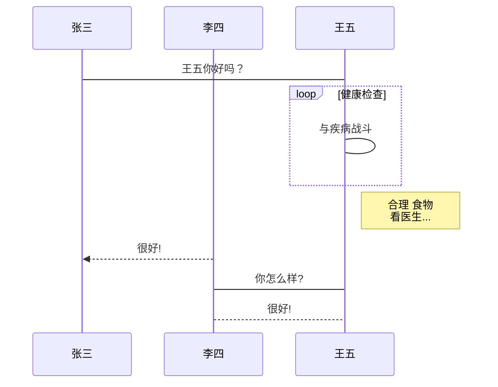

# Markdown绘制流程图

Markdown绘制流程图有很多引擎： 
1. flow 
2. mermaid
3. sequence

## **flow流程图**

flow相当于插入代码快的java/python，写在```后面


```flow
flowchat
st=>start: 开始
e=>end: 结束
op1=>operation: 操作1 | past
op2=>operation: 操作2 | current
op3=>operation: 操作3 | future
pa=>parallel: 多输出操作4 | approved
cond=>condition: 确认？ | rejected
st->op1->cond
cond(true)->e	
cond(no)->op2(right)->op3->pa(path1,right)->op1
pa(path2,left) ->e
st@>op1({"stroke":"Blue"})@>cond({"stroke":"Green"})@>e({"stroke":"Red","stroke-width":6,"arrow-end":"classic-wide-long"})
```

* 语法结构
  * flowchat
  * 定义节点
    * 类型
      * 开始(椭圆形)：start
      * 结束(椭圆形)：end
      * 操作(矩形)：opeartion
      * 多输出操作(矩形)：parallel
      * 条件判断(棱形)：condition
      * 输入输出(平行四边形)：inputoutput
      * 预处理/子程序(圣旨形)：subroutine
    * 节点定义  
      * 变量名=>节点标识:节点显示名
  * 连接节点
    *变量名1->变量名2->变量名3 
  * 样式调整
    * 1.设置变量m和变量n之间连线的样式，具体样式由变量n后面key-value控制，需要两个变量之间有直线连接。语法中的连接符为(@>)
      2.变量名m@>变量名n({"key":"value"})
  * 关键字
    * yes/true：condition类型变量连接时，用于分别表示yes条件的流向
    * no/false：同上
    * left/right：表示连线出口在节点位置，可以跟condition变量一起使用：c(yes,right)
    * path1/path2/path3：parallel变量的三个出口路径
  * 节点状态：为节点设置不同的状态，可以通过不同的颜色显示，其中状态包括下面6个，含义如英文所示
    * past
    * current
    * future
    * approved
    * rejected
    * invaild


## **Mermaid流程图**

> ```mermaid
> graph TB
> A[Apple]-->B{Boy}
> A---C>cat]
> B.->D((Dog))
> C==喵==>D
> style A fill:#2ff,fill-opacity:0.1,stroke:#faa,stroke-width:4px  
> style D stroke:#000,stroke-width:8px;
> ```

* 语法结构
  * graph 方向
    * TB/TD(top bottom/top down)表示从上到下
    * BT(bottom top)表示从下到上
    * RL(right left)表示从右到左
    * LR(left right)表示从左到右 
  * 节点以及节点连线(定义和连线步骤可以分开)
    * 节点类型
      * 默认节点：A
      * 矩形节点：B[矩形]
      * 圆形矩形节点：C(圆形矩形)
      * 圆形节点：D((圆形))
      * 非对称节点:E>非对称]
      * 菱形节点：F{菱形}
    * 节点连线
      * 箭头连线：A-->B
      * 开放连线：A---B
      * 虚线箭头连接：A.->B或者A-.->B
      * 虚线连接：A.-B或者A-.-B
      * 粗线箭头连接：a==>b
      * 粗线开放连接：a===b
      * 标签虚线箭头连接：a-.text.>b
      * 标签开放连接：a--tetx--b
  * 样式调整
    * 样式写法跟矢量图(SVG)中CSS的写法一致，含有的属性有：  
      style 节点 样式
> **节点类型**
> ```mermaid
>  graph LR 
> A---B[矩形]---C(圆形矩形)---D((圆形))---E>非对称节点]---F{棱形}
> ```

> **节点连线**
> ```mermaid
>  graph TB
>  A-->B
> A1---B1
> A2-.->B2
> A3-.-B3
> A4==>B5
> A6===B6
> A7-.TEXT.->B7
> A8-.TEXT.-B8
> ```

## 流程图实列代码

* 横向流程图源码

> ```mermaid
> graph LR
> A[方形] --->B(圆角)
> B --->C{条件a}
> C --->|a=1| D[结果1]
> C --->|a=2| E[结果2]
> F[横向流程图]
> ```

* 竖向流程图源码

> ```mermaid
> graph TD
> A[方形] --->B(圆角)
> B --->C{条件a}
> C --->|a=1| D[结果1]
> C --->|a=2| E[结果2]
> F[竖向流程图]
> ```

* 标准流程图源码

> ```flow
> a=>start: 开始框
> b=>operation: 处理框
> c=>condition: 判断框(是或否?)
> sub1=>subroutine: 子流程
> io=>inputoutput: 输入输出框
> e=>end: 结束框
> a->b->c
> c(yes)->io->e
> c(no)->sub1(right)->op
> ```

* UML时序图源码

> ```sequence
> 对象A->对象B:对象B你好吗？(请求)  
> Note right of 对象B:对象B的描述
> Note left of 对象A:对象A的描述(提示)
> 对象B-->对象A:我很好(响应)
> 对象A-->对象B:你真的好吗？
> ```

* UML时序图源码复杂样例

> ```sequence
> Title: 标题：复杂使用
> 对象A->对象B: 对象B你好吗?（请求）
> Note right of 对象B: 对象B的描述
> Note left of 对象A: 对象A的描述(提示)
> 对象B-->对象A: 我很好(响应)
> 对象B->小三: 你好吗
> 小三-->>对象A: 对象B找我了
> 对象A->对象B: 你真的好吗？
> Note over 小三,对象B: 我们是朋友
> participant C
> Note right of C: 没人陪我玩
> ```

* UML标准时序图样例



